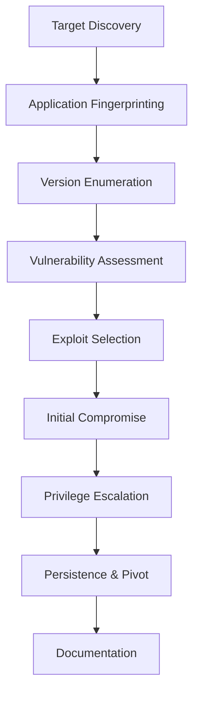

```markdown
# ⚔️ Attacking Common Applications

> [!ABSTRACT] Module Overview:
> Comprehensive methodologies for identifying, enumerating, and exploiting the most prevalent applications encountered during penetration testing engagements.

---

## 🌐 Content Management Systems (CMS)

* [[WordPress Discovery & Enumeration]]
* [[WordPress Attacks & Exploitation]]
* [[Joomla Discovery & Enumeration]]
* [[Joomla Attacks & Exploitation]]
* [[Drupal Discovery & Enumeration]]
* [[Drupal Attacks & Exploitation]]

---

## ⚙️ Development & Build Tools

* [[Tomcat Discovery & Enumeration]]
* [[Tomcat Attacks & Exploitation]]
* [[Jenkins Discovery & Enumeration]]
* [[Jenkins Attacks & Exploitation]]

---

## 📊 Infrastructure & Monitoring

* [[Splunk Discovery & Enumeration]]
* [[Splunk Attacks & Exploitation]]
* [[GitLab Discovery & Enumeration]]
* [[PRTG Network Monitor Attacks]]

---

## 🎫 Customer Service & Management

* [[osTicket System Exploitation]]

---

## 🔌 Web Interfaces & Gateways

* [Common Gateway Interface (CGI) - Shellshock Attacks](cgi-shellshock-attacks.md)
* [[IIS Tilde Enumeration]]
* [[ColdFusion Discovery & Enumeration]]

---

## 🔍 Specialized Applications

* [[LDAP Injection Attacks]]
* [[Binary Reverse Engineering]]
* [[Other Notable Applications]]

---

## Key Learning Objectives

### 🎯 **Systematic Enumeration**

- **Version Detection** - Precise version identification for vulnerability mapping
- **Plugin/Module Discovery** - Identifying third-party components and extensions
- **User Enumeration** - Valid username discovery and role identification

> [!NOTE] Automation Tools: EyeWitness, Aquatone, custom tooling

### ⚡ **Exploitation Methodologies**

- **CVE-Based Attacks** - Leveraging known vulnerabilities with public exploits
- **Configuration Attacks** - Default credentials and insecure settings
- **Logic Flaws** - Business logic vulnerabilities and application-specific bypasses

---

## Tools & Techniques

### 🛠️ **Specialized Scanners**
- [[WPScan]] - WordPress security scanner
- DroopeScan - Drupal/Joomla enumeration
- Nuclei - Multi-technology vulnerability scanner
- Custom Scripts - Application-specific enumeration tools

### 🔧 **Manual Testing Tools**
- [[Burp Suite]] - Request manipulation and vulnerability testing
- curl/wget - Command-line HTTP testing
- Browser Developer Tools - Client-side analysis and debugging
- Source Code Analysis - Static analysis techniques

---

## Real-World Application

### 🏢 **Enterprise Environments**

- Internal Networks: Employee-facing applications and development tools
- DMZ Applications: Internet-facing portals and customer services
- Cloud Platforms: SaaS implementations and hybrid deployments

---

## Methodology Framework



### **Phase 1: Discovery**
- Port scanning and service identification
- HTTP/HTTPS service enumeration
- Application fingerprinting and categorization

---

## Success Metrics

### 🎯 **Technical Proficiency**

- **Application Recognition Speed** - Rapid identification of common platforms
- **Enumeration Thoroughness** - Complete vulnerability surface mapping
- **Exploitation Success Rate** - Consistent compromise of vulnerable applications

---
```