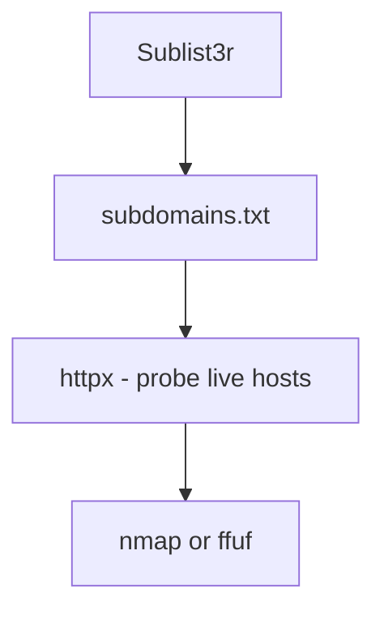

---

# 🌐 Sublist3r Cheat Sheet

> **Tool**: [Sublist3r](https://github.com/aboul3la/Sublist3r)  
> **Use**: Fast subdomain enumeration using multiple search engines and APIs.  
> **Language**: Python  
> **Category**: Reconnaissance

---

## 🧠 What is Sublist3r?

Sublist3r is a subdomain enumeration tool that uses open-source intelligence (OSINT) to gather subdomains of a domain via:

- Search engines (Google, Bing, Baidu, Yahoo)
    
- VirusTotal
    
- Netcraft
    
- ThreatCrowd
    
- DNSdumpster
    
- crt.sh
    

---

## 🛠 Installation

### ⚡ Kali/Parrot:

```bash
sudo apt install sublist3r
```

### 🐍 Manually via GitHub:

```bash
git clone https://github.com/aboul3la/Sublist3r.git
cd Sublist3r
pip install -r requirements.txt
python sublist3r.py -h
```

---

## ⚙️ Basic Syntax

```bash
sublist3r -d <domain>
```

🧠 This will enumerate subdomains of the target using default search engines.

---

## 🧪 Common Examples

### 🔍 Basic scan

```bash
sublist3r -d example.com
```

### 💾 Save output to a file

```bash
sublist3r -d example.com -o subdomains.txt
```

### ⚡ Fast scan with threading

```bash
sublist3r -d example.com -t 50
```

### 🧃 Use specific engines

```bash
sublist3r -d example.com -e Google,Yahoo,Bing
```

---

## 🧩 Full Option Reference

|Flag|Description|
|---|---|
|`-d`|Target domain (required)|
|`-b`|Enable brute-force subdomain enumeration|
|`-o`|Output file name|
|`-t`|Number of threads (default: 10)|
|`-v`|Enable verbose output|
|`-e`|Comma-separated list of search engines to use|
|`-h`|Show help menu|

---

## 🚀 Real-World Workflow

```bash
sublist3r -d company.com -t 50 -o company_subs.txt -v
```

➡️ Then probe live hosts:

```bash
cat company_subs.txt | httpx -silent
```

---

## 🔐 Brute Force Mode

```bash
sublist3r -d example.com -b -t 50
```

Uses a built-in subdomain wordlist to brute-force additional entries.

---

## 💡 Tips

- Sublist3r is passive; it does not interact directly with the target.
    
- Combine with `httpx`, `amass`, or `assetfinder` for more thorough enumeration.
    
- Output can be fed into tools like:
    
    - `nmap`
        
    - `ffuf`
        
    - `dirsearch`
        

---

## 🗂 Common Wordlists (for bruteforce)

- `/usr/share/seclists/Discovery/DNS/`
    
    - `dns-Jhaddix.txt`
        
    - `subdomains-top1million-5000.txt`
        

---

## 📎 Sublist3r vs Other Tools

|Tool|Passive|Active|Brute Force|Speed|Notes|
|---|---|---|---|---|---|
|Sublist3r|✅|❌|✅|⚡ Fast|Great for quick scans|
|Amass|✅|✅|✅|🐢 Slow|Most comprehensive|
|Assetfinder|✅|❌|❌|⚡ Very fast|Minimal results|
|Subfinder|✅|❌|❌|⚡ Fast|More modern|

---

## 🧠 Output Example

```
blog.example.com
shop.example.com
dev.example.com
api.example.com
test.example.com
```

---

## 📦 Recommended Workflow



---

## 🧷 Save this in Obsidian

🗂 Suggested file path:

```
/Notes/Hacking/Recon/Sublist3r-CheatSheet.md
```

---

Let me know if you’d like a zipped `.md` + wordlist bundle or a version that includes other recon tools like Subfinder, Amass, and Assetfinder in a single cheat sheet!